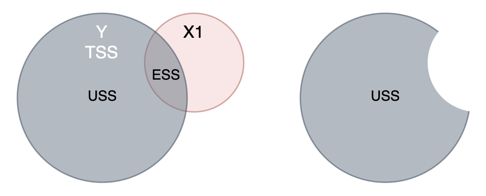
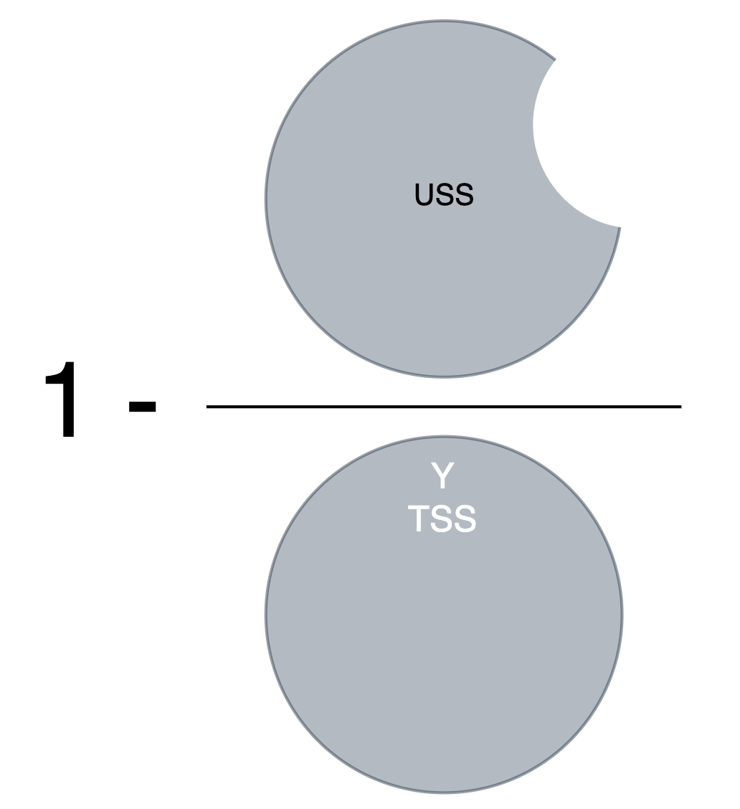
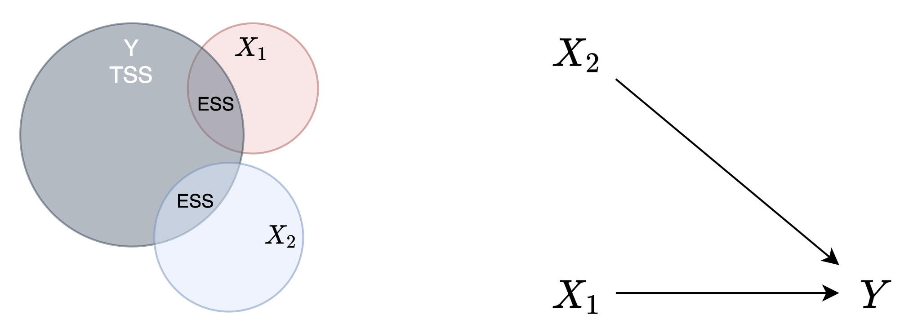
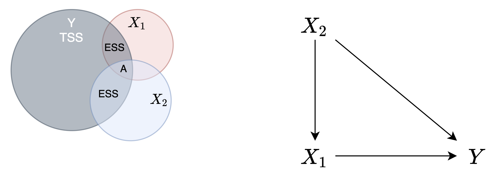
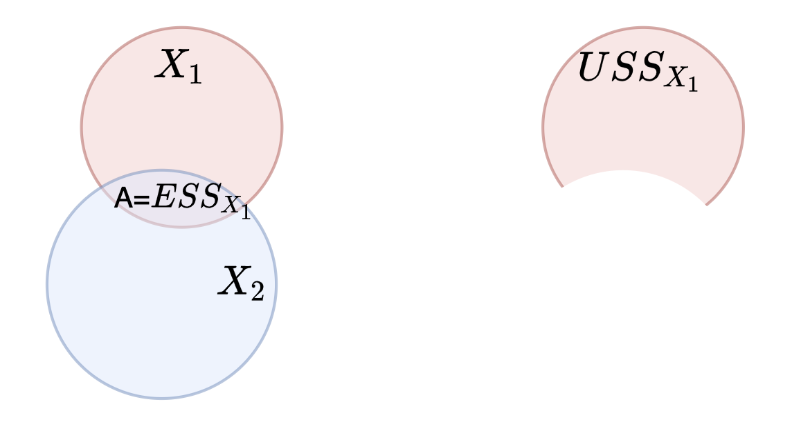
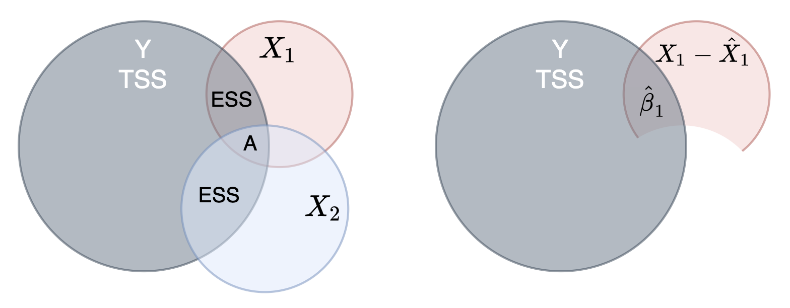
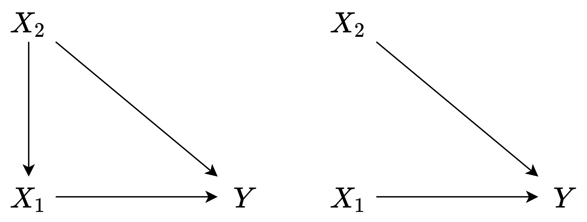
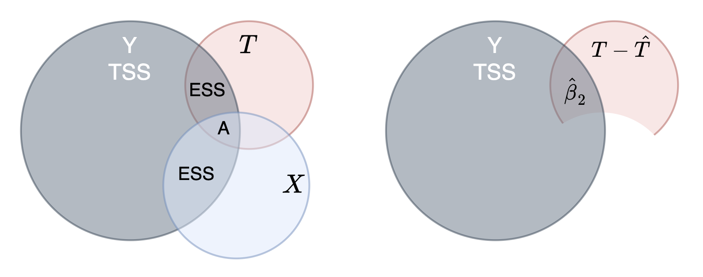

------------------------------------------------------------------------

-   5章では、回帰モデルと最小二乗法の基礎を実施
-   3.9節で扱った共分散分析につながる重回帰モデルの基礎を解説していく
-   重回帰モデルは、本格的には行列を使う（が、難易度が上がるのでやらない）
-   バレンティン・ベン図を使って、どのように交絡を統制しているかを見ていく

------------------------------------------------------------------------

本章で使うデータを読み込んでおきます

```{r データ読み込み, warning=FALSE}
library(tibble)
library(knitr)
library(kableExtra)
library(VennDiagram)

options(rgl.useNULL=TRUE)     # before call library(grl)
library(vennplot)
```

```{r}
rm(list=ls())

load_data <- function(){
  url.data.file <- "https://raw.githubusercontent.com/mtakahashi123/causality/main/data06.csv"
  D <- read.csv(url(url.data.file))
  return(D)  
}

D <- load_data()

tabular <- function(df, color=F, title="表"){
    df %>%
    rownames_to_column(var="ID") %>%
    kable(caption=title) %>%
    kable_styling(fixed_thead=T, bootstrap_options=c("striped", "hover", "condensed"))
}

# tabular(D[1:5, ])
```

# 6.1 データ

-   Messerli(2012, p.1563, p.1564)
    -   国ごとのノーベル賞受賞者数とチョコレートの消費量に、正の相関があることを報告
    -   相関は因果を証明しない
    -   一方で、チョコレートには認知機能を改善する効果がある
        -   チョコレートの接種がノーベル賞受賞に繋がるのではないかとしている
    -   チョコレートの消費とノーベル賞受賞者数の両方に共通するものを見つけるものは難しいと主張
        -   疑似相関の可能性を明確に否定
-   中室・津川, 2017, p.52; 清水, 2017, pp.3-7; 竹村, 2018, p.78
    -   共通の原因として、各国の経済力があると指摘し、疑似相関と考えられている
    -   このような背後影響を及ぼしている変数を、交絡因子という
-   本章
    -   1人当たりの国内総生産（GDP per captia）を交絡因子の候補として利用
    -   ノーベル賞受賞者数とチョコレート消費量の関係について、実際にデータを使って検証

## 基本統計量

-   x1 : 人口1人当たりの年間のチョコレート消費量(kg)
-   x2 : 人口1人当たりの国内総生産(単位：1000米ドル)
-   y1 : 人口1千万人当たりのノーベル賞受賞者数

```{r 表2.1}
table_6.1 <- function(){
  tabular(D, title="表6.1 データ")
}

table_6.1()
```

```{r 基本統計量}
n1 <- nrow(D)
attach(D)

summary(D)
n1
```

-   本書では、`country` 変数は使わない
-   詳しくみたい人は、`view(D)` などで参照

```{r view}
view(D)
```

------------------------------------------------------------------------

# 6.2 分散

-   不偏分散
    -   変数$Y$ の個々の値と変数$Y$ の平均値である偏差を計算
    -   その偏差を2乗してから足した偏差平方和を自由度$n-1$ で割った値
    -   分散は、予測からのばらつきの大きさを表す

$$
\begin{align}
V[Y_i] := \frac{1}{n-1} \sum_{i=1}^{n} (Y_i - \bar{Y})^2
\end{align}
\tag{6.1}
$$ - 注意 - テキストでは、分散を$\text{var}[Y]$ と記載しているが、個人的になれている記号$V[Y]$ としている

## TSS

-   変数Y の総和変動, TSS: Total Sum of Squares
    -   分散、不偏分散の分子 (偏差平方和の部分)

$$
\begin{align}
\text{TSS} := \sum_{i=1}^{n} (Y_i - \bar{Y})^2
\end{align}
$$

```{r ノーベル賞受賞者数Y1のTSS}
dev.1 <- y1 - mean(y1)
dev.2 <- dev.1 ^ 2
tss <- sum(dev.2)

tss
tss / (n1 - 1)    # 不偏分散: var(y1) と一致
var(y1)
```

-   ベン図で重回帰モデルのメカニズムを解説していく

```{r ベン図}
cmb <- c(Y=sd(y1), X1=sd(x1), X2=sd(x2))
v <- vennplot(cmb, expand=1.1)
```

-   y1, x1, x2 の 不偏標準偏差を円の半径として描画
    -   X1 のばらつきが最も小さい
    -   X2 のばらつきが最も大きい
    -   変数Y のばらつきが２番目に大きい
        -   変数Y の総和変動(TSS)
-   ベン図の書き方
    -   厳密に図を作成するには、サークルの面積がTSSに比例するように作成
    -   サークルの重なりで、変数間の関連を表現
-   バレンティン・ベン図 (Ballentine Venn Diagram)
    -   重回帰モデルにおける変数間の関連を表すベン図のこと

------------------------------------------------------------------------

# 6.3 ESSとUSS

-   重回帰モデルの前に、単回帰モデル $\hat{Y} := \hat{\beta}_0 + \hat{\beta}_1 X_{1i}$ を考える
    -   つまり、各国の経済力を考慮せず
        -   チョコレートの消費量がノーベル賞受賞者数にどれぐらいの効果を持っているかを調べる
-   前章・５章より

$$
\begin{align}
\hat{\beta}_1 &= \frac{\sum_{i} (X_i - \bar{X})(Y_i - \bar{Y})}{\sum_{i} (X_i - \bar{X})^2}
\tag{6.2} \\
\hat{\beta}_0 &= \bar{Y} - \hat{\beta}_1 \bar{X}
\tag{6.3} \\
\end{align}
$$

-   R関数の lm 関数を使って演算

```{r 単回帰モデル}
model.1 <- lm(y1 ~ x1)

cat("///// Sinle Linear Model /////", "\n")
summary(model.1) 

cat("///// 95% Confidence Interval /////", "\n")
confint(model.1, level=0.95)
```

-   x1 の 傾きの値は、`Coefficients` の x1 行 `Estimate` の列「2.7044」

    -   解釈
        -   チョコレートの消費量が 1(kg) 多いと、人口1千万人当たりのノーベル賞受賞者数は平均して約2.7044人多い

-   95%信頼区間は、「1.460 〜 3.949」なので、5% の有意水準で帰無仮説$\beta_1 = 0$ を棄却できる

-   ノーベル賞受賞者数 y1 と チョコレート消費量 x1 の関係をプロット

```{r xとyの関係をplot}
plot(x1, y1)
```

-   上図・散布図の通り
    -   Messerli (2012) の報告通り、国ごとのノーベル賞受賞者数y1 とチョコレート消費量x1 には、正の相関がありそう
        -   （感想：ん？そうかなー・・・）

## ESS

-   ESS: Explained Sum of Squares
    -   X1 を説明変数とする単回帰モデルによって説明できる Yの変動部分

$$
\begin{align}
\text{ESS} := \sum_{i=1}^{n} (\hat{Y}_i - \bar{Y})^2
\end{align}
\tag{6.4}
$$

```{r モデルの係数(学習済パラメータ)を確認}
model.1$coefficients
model.1$coefficients["(Intercept)"]
model.1$coefficients["x1"]
```

```{r ESS}
beta.0 <- model.1$coefficients["(Intercept)"]
beta.1 <- model.1$coefficients["x1"]

y.hat <- beta.0 + beta.1 * x1
ess <- sum((y.hat - mean(y1))^2)

cat("///// y.hat /////", "\n")
y.hat

cat("///// ESS /////", "\n")
ess

```

```{r}
predict(model.1) # y.hat と同じ結果
```

## USS

-   USS: Unexplained Sum of Squares
    -   X1 を説明変数とする単回帰モデルによっては説明できない Yの変動部分
    -   残差平方和ともいう

$$
\begin{align}
\text{USS} := \sum_{i=1}^{n} (Y_i - \hat{Y}_i)^2 = \sum_{i=1}^{n} e_i^2
\end{align}
\tag{6.5}
$$ - ここで、 - $e_i$ : 残差 - $e_i := Y_i - \hat{Y}_i$

```{r USS}
e.1 <- y1 - y.hat
uss <- sum(e.1^2)

cat("///// e.1 /////", "\n")
e.1
cat("///// USS /////", "\n")
uss
```

```{r}
resid(model.1)    # e.1 と同じ結果
```

## TSS, ESS, USS の関係

-   TSS = ESS + USS

```{r TSS, ESS, USS}
cat("///// TSS /////", "\n")
tss

cat("///// ESS /////", "\n")
ess

cat("///// USS /////", "\n")
uss

cat("==============================", "\n")
cat("///// TSS = V[Y] * (n-1) /////", "\n")
tss
var(y1) * (n1 - 1)

cat("///// ESS + USS /////", "\n")
ess + uss

cat("///// ESS = V[Y.hat]*(n-1) /////", "\n")
var(y.hat) * (n1 - 1)

cat("///// because E[Y.hat] = E[Y] /////", "\n")
mean(y.hat)
mean(y1)
```

-   図で表現すると、以下のようなイメージになる

{width="500"}

-   Yの変動（TSS）のうち、説明変数 X1 を使って説明できる変動(ESS)を除いた変動が単回帰モデル - 残りの説明できなお変動(USS; 残差平方和)

------------------------------------------------------------------------

# 6.4 決定係数

-   決定係数
    -   単回帰モデル(と重回帰モデル)では、X1 を説明変数とする単回帰モデルから説明できる Yの変動部分の割合
        -   これは、TSS = ESS + USS が成立するから言える

$$
\begin{align}
R^2 &:= 1 - \frac{\sum_{i} (Y_i - \hat{Y}_i)}{\sum_{i} (Y_i - \bar{Y})} \\
 &= 1 - \frac{USS}{TSS} \\
\end{align}
\tag{6.6}
$$

特に、単回帰モデル、重回帰モデルでは

$$
\begin{align}
R^2 &= 1 - \frac{USS}{TSS} \\
    &= \frac{TSS - USS}{TSS} \\
    &= \frac{ESS}{TSS} \\
\end{align}
$$

前節で算出した、USS, TSS を使って確認

```{r USS, TSS -> R^2}
uss
tss

cat("", "\n")
cat("///// R^2 /////", "\n")
1 - uss/tss
ess/tss
```

$$
\begin{align}
R^2 &= 1 - \frac{USS}{TSS} \\
    &= 1 - \frac{928.6765}{1831.718} = 0.4930025 \\
\end{align}
$$

-   解釈例
    -   単回帰モデルは、説明変数により結果変数の変動の約49.3%($R^2$の値パーセント)を説明できる、と解釈する
    -   e.g. チョコレート消費量を説明変数とする単回帰モデルから、ノーベル賞受賞者数の変動の約49.30%を説明できる
-   上記のように、手計算した$R^2$ は、回帰モデルの結果から得られる決定係数の値と一致する
    -   (実用上は、後者(回帰モデルの結果に含まれる決定係数の値)を使えばいい)

```{r R^2}
1 - uss/tss
summary(model.1)$r.squared
```

{width="250"}

------------------------------------------------------------------------

# 6.5 回帰係数の標準誤差と回帰の標準誤差

-   回帰係数$\hat{\beta}_1$ の標準誤差
    -   分母は、説明変数X がどれぐらいばらついているか
    -   分子 $s_{reg}$は、回帰の標準誤差
        -   1自由度あたりの回帰モデルで説明できない変動、ばらつき (後述参照)
    -   結果論として、説明変数の変動に対して、1自由度あたり平均的に説明できない変動の割合を意味する

$$
\begin{align}
s.e.(\hat{\beta}_1) := \frac{s_{reg}}{\sum_{i} (X_i - \bar{X})^2 } \\
\end{align}
\tag{6.8}
$$

-   $s_{reg}$ : 回帰の標準誤差 (standard error of the regression)
    -   回帰モデル全体の標準誤差
    -   分子は、USS
        -   回帰で説明できない変動、ばらつき
    -   分母の $n-k$ は、自由度
        -   $k$ : 推定すべき母数（パラメータ）の個数
        -   自由度1 に対して、平均的にどれぐらい説明できない変動、ばらつきがあるか、を意味している

$$
\begin{align}
s_{reg} &:= \sqrt{ \frac{\sum_{i} (Y_i - \hat{Y}_i)^2 }{ n-k }} \\
        &= \sqrt{ \frac{USS}{n-k} }
\end{align}
\tag{6.9}
$$

------------------------------------------------------------------------

# 6.6 三変数のバレンティン・ベン図

-   変数が三つの場合を考える
    -   $Y$ : 結果変数
    -   $X_1$, $X_2$ : 2つの説明変数
-   ベン図で考えよう
    -   $Y$と$X_1$, $X_2$ の重なり部分は、ESS
    -   $X_1$, $X_2$ は、独立なので重ならない
        -   i.e. 相関が0

## 参考 : 独立なら無相関

-   $X_1$, $X_2$が独立なら、$X_1$, $X_2$ の相関係数が0 (無相関)

$$
\begin{align}
\text{Cov}(X_1, X_2) &= E[X_1X_2] - E[X_1]E[X_2] \\
            &= E[X_1]E[X_2] - E[X_1]E[X_2] & (\because X_1 \perp X_2) \\
            &= 0 \\
\\
\text{Cor}(X_1, X_2) & = \frac{\text{Cov}(X_1,X_2)}{\sqrt{V[X_1]V[X_2]}} \\
            & = \frac{0}{\sqrt{V[X_1]V[X_2]}} \\
            &= 0
\end{align}
$$

-   図で表すと、以下のように表現できる

## 独立な説明変数の重回帰モデル

{width="500"}

-   この時
    -   $X_1$, $X_2$ の重回帰モデル $\hat{Y}_i = \hat{\beta}_0 + \hat{\beta}_1 X_{1i} + \hat{\beta}_2 X_{2i}$ の $\hat{\beta}_1$は、
    -   $X_1$ の単回帰モデル $\hat{Y}_i = \hat{\beta}_0 + \hat{\beta}_1 X_{1i}$ の $\hat{\beta}_1$ と一致する
    -   $X_2$ をモデルに含めなくても、$\hat{\beta}_1$ は $\beta_1$ の不偏推定量
-   効果の修飾
    -   上図を見る
    -   単回帰モデルに比べて、重回帰モデルの方が ESS の部分が増えている
    -   つまり、$Y$ の変動を説明する力が向上している
        -   この向上する現象を、「効果の修飾」という
    -   別の用語としての使い方
        -   $X_1$ から $Y$ への平均処置効果(ATE) が $X_2$ の値に応じて変化する場合
            -   $X_2$ は、$X_1$ から $Y$ への効果を修飾する、ということもある (疫学の分野)
        -   ATE か ESS かの違い
-   標準誤差への影響
    -   回帰係数の不偏性には影響を与えない
    -   USS に影響がある($X_2$ の ESS の文だけ現象する)ため、回帰係数の標準誤差の大きさに影響を与える
    -   データセット内に含まれているなどで、利用できる場合は、可能な限り利用した方がよい、と言える
-   実験研究（処置の割付けが無作為）
    -   精度を向上させるのに有用
    -   R.A Fisher によって提唱された 共分散分析(ANCOVA) の目的はここだったらしい
    -   ANCOVA のモデル式を思い出そう ($X_1 := X, X_2 := T$) $$
        \hat{Y}_i = \hat{\beta}_0 + \hat{\beta}_1 X_{i} + \hat{\beta}_2 T_i
        $$
    -   独立した変数がデータセット内に含まれてなくてモデルに取り込めていなくても大きな問題ではない
        -   独立した変数は、回帰係数の不偏性には影響を与えないので、既存の変数の推定に影響を与えない

## 独立でない説明変数の重回帰モデル

-   $X_1$, $X_2$ に重なりがあるケースを考える
    -   i.e. $X_1 \not \perp X_2$ (独立でない)
    -   ここでは、$X_2 \rightarrow X_1$ という方向の依存関係がある例を考える
    -   2章などの、数学の試験において、補習を受ける受けないを入学試験の成績で決定したようなケース
-   単回帰モデルを考える
    -   $\hat{Y}_i = \hat{\beta}_0 + \hat{\beta}_1 X_{1i}$ の $\hat{\beta}_1$ は、
    -   下図の「A」の部分が含まれている
        -   この「A」は、$X_2$ からの間接効果 ($X_2 \rightarrow X_1 \rightarrow Y$)
            -   交絡ともいう
    -   つまり、下図の$X_1$, $X_2$ が重なっている部分の「A」を取り除いて分析する必要がある
    -   観察研究において、共分散分析(ANCOVA) は、このような状況での統計的因果推論の役に立つことがある

{width="500"}

------------------------------------------------------------------------

# 6.7 三変数の重回帰モデル

-   $Y_i = \beta_0 + \beta_1 X_{1i} + \beta_1 X_{2i} + \epsilon_i$ において
    -   $\beta_1$ の偏りがない推定をすることを考える
    -   前節の「A」の部分 ($X_1$ と $X_2$ の重なっている部分)を取り除いて
    -   $X_1$ から $Y$ への純粋な効果を計る方法を考察する
-   三変数の重回帰モデル
    -   最小二乗法による $\beta_0, \beta_1, \beta_2$ の推定方法
    -   $\beta_1, \beta_2$ : 偏回帰係数 (partial regression slope)
    -   $\hat{X}_{1i} := a_1 + b_1 X_{2i}$
    -   $\hat{X}_{2i} := a_2 + b_2 X_{1i}$

$$
\begin{align}
\hat{\beta}_1 = \frac{\sum_i (X_{1i} - \hat{X}_{1i})(Y_i - \bar{Y})}{\sum_i (X_{1i} - \hat{X}_{1i})}
\end{align}
\tag{6.10}
$$

$$
\begin{align}
\hat{\beta}_2 = \frac{\sum_i (X_{2i} - \hat{X}_{2i})(Y_i - \bar{Y})}{\sum_i (X_{2i} - \hat{X}_{2i})}
\end{align}
\tag{6.11}
$$

$$
\begin{align}
\hat{\beta}_0 = \bar{Y} - \hat{\beta}_1 \bar{X}_1
\end{align}
\tag{6.12}
$$

-   三変数の重回帰モデルは、２段階
    -   $\hat{X}_{1i} = a_1 + b_2 X_{2i}$ を作る ($X_{2i}$ から予測値 $\hat{X}_{1i}$ を作る)
    -   残差 $X_{1i} - \hat{X}_{1i}$
    -   「A」の部分は、$ESS_{X_{1}}$
-   この手順により、変数 $X_2$ から交絡Aを取り除いた様子が以下の図右

{width="500"}

$$
USS_{X_{1}} = \sum_{i=1}^{n} (X_{1i} - \hat{X}_{1i})
$$

-   2段階目で変数$Y$を推定する様子が以下の図右
    -   図の左は、既出の図6.7の図

{width="500"}

-   実際に計算してみる

```{r 二段階の推定モデル}
model.step.1 <- lm(x1 ~ x2)
e.x1 <- resid(model.step.1)   # X1 - X1.hat / X1 の残差

model.step.2 <- lm(y1 ~ e.x1)
model.mul <- lm(y1 ~ x1 + x2)

cat("///// 2 Step Model /////", "\n")
summary(model.step.2)

cat("///// Multi Model /////", "\n")
summary(model.mul)

```

-   ２つのモデル（手製２ステップモデルと、lm によるモデル）の回帰係数を比較

```{r 回帰係数}
cat("///// 2 Step Model /////", "\n")
summary(model.step.2)$coefficients["e.x1", 1]

cat("///// Multi Model /////", "\n")
summary(model.mul)$coefficients["x1", 1]
```

-   回帰係数(偏回帰係数)の比較結果
    -   いずれのモデルでも、回帰係数$\hat{\beta}_1 \approx 1.504773$ で一致

```{r 信頼区間}
cat("///// 2 Step Model /////", "\n")
confint(model.step.2, level=0.95)

cat("///// Multi Model /////", "\n")
confint(model.mul, level=0.95)
```

-   教科書的な解釈
    -   1人当たりの国内総生産が一定であるなら ($X_2$ が変動しない前提としたら)
        -   人口1人当たりのチョコレート消費量が1(kg)大きくなると、
        -   人口1千万人当たりのノーベル賞受賞者数は、平均して約$1.505$人増加する、と言える
    -   重回帰モデルの 95%信頼区間は、$-0.073 \sim 3.082$ であるため、区間の中に$0$が含まれている
        -   つまり、5%の有意水準で帰無仮説$\hat{\beta}_1 = 0$ を棄却できない
-   単回帰分析$\hat{Y}_i = \hat{\beta}_0 + \hat{\beta}_1 X_{1i}$ の結果を振り返り

```{r 単回帰分析結果を思い出そう}
model.1$coefficients["x1"]
```

-   単回帰モデルでは、$\hat{\beta}_1 = 2.704$と推定
-   一方で、国ごとの経済力$X_2$ を考慮に入れた、2ステップモデル／重回帰モデルの結果は $1.505$
    -   単回帰モデルに比べ、2ステップモデル/重回帰モデルの方が小さくなっている
    -   つまり、単回帰モデルでは、チョコレート消費量の効果を過大に見積もっていたと解釈できる
    -   また、帰無仮説$\beta_1 = 0$ を棄却できないことから、実際の効果が $0$ であることを排除できなくなった
        -   「5%の有意水準で統計的に有意でない」という
        -   点推定値として、$\hat{\beta}_1 = 2.704$と推定されるが、 誤差の範囲と区別がつかない、ということを意味している
-   まとめると
    -   国ごとの経済力を考慮に入れると、チョコレートの消費量は、ノーベル賞受賞者数に対して因果的な効果を持っているとは、（必ずしも）言えない、と結論づけられる

------------------------------------------------------------------------

# 6.8 因果ダイアグラムによる考察

-   DAG (非巡回グラフ) で視覚的に考察
    -   $Y$ : ノーベル賞受賞者数
    -   $X_1$ : チョコレート消費量
    -   $X_2$ : GDP
-   $X_1$ から $Y$ への影響を知りたい
    -   左図では、$X_2$ が $X_1$, $Y$ の両方に影響を及ぼしている
        -   $X_2$ : 交絡因子
    -   右図は、$X_2$ から $X_1$ への矢印をブロックしたことを著している
        -   実は、前節まででは、重回帰モデルを使うことで、ブロックが成功したことをみてきた
        -   また、$\hat{\beta}_1$ に対する信頼区間が $0$ を含んでいることも踏まえ
            -   $X_1$ から $Y$ への純粋な効果は極めて小さい（あるいは、効果がない）ということがわかったのであった

{width="500"}

# 6.9 共分散分析（再考）

## 振り返り

-   共分散分析(ANCOVA)
    -   ダミー変数を説明変数として持つ重回帰モデル、のことであった

$$
Y_i = \beta_0 + \beta_1 X_i + \beta_2 T_i + \epsilon_i
$$

{width="500"}

-   $\beta_2$ は、結果変数 $Y$ の変動を説明する際に
    -   共変量に対して、ダミー変数$T$ の純粋な貢献度合いを表していると考えることができる
    -   共分散分析を用いることで、なぜ平均処置効果(ATE)を正しく推定できていたかを確認しておこう
-   3.9節を思い出そう
    -   t1 の回帰係数(Estimate)の値は、$9.82$と推定されていた
    -   真の平均処置効果(ATE)は、$9.8$であった
    -   つまり、適切に推定ができていた
-   実際に2段階で分析して確認

```{r}
load_data3 <- function(){
  url.data.file <- "https://raw.githubusercontent.com/mtakahashi123/causality/main/data03.csv"
  D <- read.csv(url(url.data.file))
  return(D)  
}
D3 <- load_data3()

model.chapter3.step.1 <- lm(t1 ~ x1, data=D3)
e.t1 <- resid(model.chapter3.step.1)

cat("///// 2 Step Model /////", "\n")
model.chapter3.step.2 <- lm(y3 ~ e.t1, data=D3)
lm(model.chapter3.step.2)

cat("///// ATE /////", "\n")
mean(D3$y1t) - mean(D3$y0t)
```

------------------------------------------------------------------------

# 6.10 実験研究における共分散分析の活用

-   処置の割付けが無作為化されている実験研究
    -   運悪く共変量のバランシングがうまくとれていない場合がある
        -   観測される共変量に対して、処置群と統制群の間で平均値や標準誤差、分布が異なっている
    -   この時、観測される共変量をモデルに取り入れた共分散分析を行うことでバランシングできる
-   処置の無作為割付け自体が成功 (交絡因子を気にする必要がない) 場合A
    -   図6.6 のように、結果変数の変動を説明することに寄与する変数があれば
        -   その共変量をモデルに追加することが望ましい
        -   ただし、この場合は共変量を活用しなくても大きな問題はない

------------------------------------------------------------------------

# 本章のまとめ

-   チョコレート消費量とノーベル賞受賞者数の関係について回帰分析を通して理解をする流れ
-   GDP の チョコレート消費量への影響を除いた分析による回帰係数と重回帰分析の偏回帰係数が一致することをみてきた
    -   2ステップによる分析と重回帰分析の回帰係数を比較した
    -   結果的に、「中室・津川」の主張のように、各国の経済力による疑似相関があるという解釈は妥当そうである
        -   [6.7章参照](#(10))
-   また、ベン図を使って、変数と変動（TSS, ESS, USS）の関係性を視覚的に理解を進めてきた
    -   特に、単回帰分析、重回帰分析では、`TSS = ESS + USS` であった
-   決定係数の定義と解釈の仕方
-   回帰の標準誤差とUSSの関係
-   三変数の重回帰モデルについて
    -   独立な説明変数による重回帰モデル : 実験研究
    -   独立でない説明変数による重回帰モデル : 観察研究
    -   ベン図を用いて分析プロセスを可視化
    -   教科書的な解釈
    -   ANCOVAの重回帰モデル

**End.**
