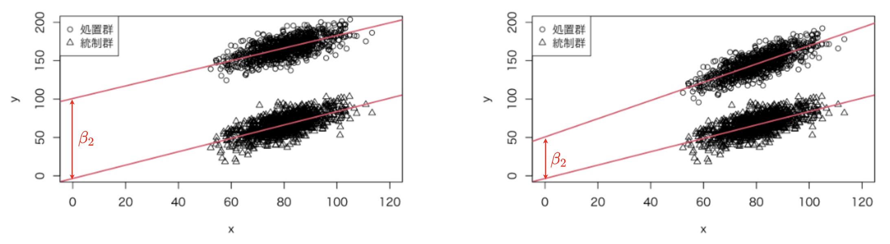

------------------------------------------------------------------------

-   共分散分析(ANCOVA)
    -   古くから無作為化実験における精度を向上できる (Cochran, 1957, p.262)
    -   観察研究における交絡変数の影響を取り除く役割も (Cochran, 1957, p.264)
    -   i.e. 共分散分析は、統計的因果推論において重要
-   本章
    -   共分散分析に必要な仮定を確認
    -   交互作用のある共分散分析を導入
    -   統計的因果推論の手法として、共分散分析の限界

------------------------------------------------------------------------

本章で使うデータを読み込んでおきます

```{r データ読み込み, warning=FALSE}
library(tibble)
library(knitr)
library(kableExtra)
```

```{r}
rm(list=ls())

load_data <- function(){
  url.data.file <- "https://raw.githubusercontent.com/mtakahashi123/causality/main/data09.csv"
  D <- read.csv(url(url.data.file))
  return(D)  
}

D <- load_data()

tabular <- function(df, color=F, title="表"){
    df %>%
    rownames_to_column(var="ID") %>%
    kable(caption=title) %>%
    kable_styling(fixed_thead=T, bootstrap_options=c("striped", "hover", "condensed"))
}

# tabular(D[1:5, ])
```

------------------------------------------------------------------------

# 9.1 共分散分析の仮定

-   共分散分析は、重回帰分析の一種
    -   共変量の影響による偏りを調整する有力な方法の１つ
    -   (他の変量の影響を受けた回帰係数が得られたことを思い出そう)

$$
Y_i = \beta_0 + \beta_1 X_i + \beta_2 T_i + \epsilon_i
\tag{9.1}
$$

-   重回帰分析の仮定1 〜 仮定6 を満たす必要がある
    -   第7章、第8章参照
-   共分散分析では、仮定7 も満たす必要がある
-   **仮定7** : 回帰関数の平行性 (homogeneity of regression)
    -   回帰の傾き$\beta_1$ が潜在的結果変数 $Y_i(0), Y_i(1)$ の間で共通という仮定

## 仮定7 の意味

まずは、図を見ましょう

```{r}
set.seed(12345)


x <- 80 + 10*rnorm(1000)
beta1 <- 5/6
eps <- 10 * rnorm(1000)
y <- beta1 * x + eps

par(family = "HiraKakuProN-W3")

plot(x, y, xlim=c(0, 120), ylim=c(0, 200), pch=2)
model <- lm(y ~ x)
abline(model, col=2, lwd=2)

par(new=T)

beta2 <- 100
eps2 <- 10 * rnorm(1000)
y <- beta1 * x + beta2 + eps2
plot(x, y, xlim=c(0, 120), ylim=c(0, 200))
model <- lm(y ~ x)
abline(model, col=2, lwd=2)

legend("topleft", legend=c("処置群", "統制群"), pch=c(1, 2))

```

```{r}
set.seed(12345)

x <- 80 + 10*rnorm(1000)
beta1 <- 5/6
eps <- 10 * rnorm(1000)
y <- beta1 * x + eps

par(family = "HiraKakuProN-W3")

plot(x, y, xlim=c(0, 120), ylim=c(0, 200), pch=2)
model <- lm(y ~ x)
abline(model, col=2, lwd=2)

par(new=T)

beta1.2 <- 6/5
beta2 <- 50
eps2 <- 10 * rnorm(1000)
y <- beta1.2 * x + beta2 + eps2
plot(x, y, xlim=c(0, 120), ylim=c(0, 200))
model <- lm(y ~ x)
abline(model, col=2, lwd=2)

legend("topleft", legend=c("処置群", "統制群"), pch=c(1, 2))
```

{width="1000"}

-   上記の図について
    -   左側は、仮定7 が満たされている状態
    -   右側は、仮定7 が満たされていない状態
-   統制群では、$T_i = 0$
    -   推定式は、$\hat{Y}_i = \hat{\beta}_0 + \hat{\beta}_1 X_i$
    -   $\beta_0$ が $Y$ 切片で、$x = 0$ の時の値
-   処置群では、$T_i = 0$
    -   推定式は、$\hat{Y}_i = (\hat{\beta}_0 + \hat{\beta}_2) + \hat{\beta}_1 X_i$
-   つまり
    -   $\beta_2$ が 統制群と処置群の間の $Y$ 切片の差
    -   回帰の傾き$\beta_1$ が潜在的結果変数 $Y_i(0), Y_i(1)$ の間で共通
        -   i.e. 2つの集団間で、回帰直線が平行ということ
    -   仮定7 が満たされていれば、切片の差ということだけでなく
        -   「処置群と統制群の間の平均的な差」を意味している
        -   図からも、x の値にかかわらず、2つの集団には、平均して$\beta_2$ の差がある
        -   つまり、$\beta_2$ が平均処置効果 (ATE)
-   右図のように、仮定7 が満たされていないとき
    -   共分散分析の式(9.1) は、不適切
    -   代わりに、下記 式(9.2) のように、交互作用項(interaction term) があるモデルを使う
        -   交互作用項は、2つの変数の積 (e.g. $X_i T_i$)
        -   (9.2) のモデルでは、$\beta_2$ は単に２つの集団の切片の差を表している
            -   処置群と統制群の間の平均的な差を意味しているわけではない
        -   x の値に依存して、2つの集団の差は変化
            -   $\beta_2$ の値で捉えることができない
            -   この点は、9.2節にて (乞うご期待？！)

$$
Y_i = \beta_0 + \beta_1 X_i + \beta_2 T_i + \beta_3 X_i T_i + \epsilon_i
\tag{9.2}
$$

## データで確認

-   x1 : 入学試験の点数
    -   x1 $\sim N(80, 10)$
-   y0t, y1t: 潜在的結果変数
    -   y0t := 0.6 \* x1 + e1
    -   y1t := 60 + 1.2 \* x1 + e2
    -   e1 $\sim N(0, 7)$
-   y3: 実際に観測される結果変数
-   t1: 処置の割付け変数
    -   u1, u2 : 区間$[0, 1]$ の一様乱数
    -   t1 = 0, x1: 中央値以下 かつ u1が0.75 以下の時
    -   t1 = 1, x1: 中央値以下 かつ u1が0.75 より大きい時
        -   x1が中央値以下の時、$\frac{3}{4}$ の確率で、t1=0
        -   x1が中央値以下の時、$\frac{1}{4}$ の確率で、t1=1、ということ
    -   t1 = 1, x1: 中央値より大きく かつ u2が0.50 以下の時
    -   t1 = 0, x1: 中央値より大きく かつ u1が0.50 より大きい時
        -   x1が中央値より大きい時、$\frac{1}{2}$ の確率で、t1=1, t1=0、ということ
-   つまり、交絡が発生している例である
    -   x1(入学試験の結果)の中央値で、t1(処置)の割付け確率が変わっている点に注意

```{r}
attach(D)
summary(D)
```

-   平均処置効果(ATE)

$$
\tau_{ATE} = E[Y_i(1)] - E[Y_i(0)]
$$

-   $E[Y_i(0)] = E[y0t] = 0.6 \times 80 + 0 = 48$
-   $E[Y_i(1)] = E[y1t] = 60 + 1.2 \times 80 + 0 = 156$
    -   x1 の平均は、80
    -   e1, e2 の平均は、0
-   平均処置効果は、
    -   $\tau_{ATE} = E[Y_i(1)] - E[Y_i(0)] = 156 - 48 = 108$

では、実際に解析していこう

```{r}
mean(y1t) - mean(y0t)         # 真の平均処置効果ATE
model.1 <- lm(y3 ~ x1 + t1)   # 共分散分析
summary(model.1)

model.1$coefficients["t1"]
```

-   このデータでの潜在的結果変数による平均処置効果の推定値は、108.174
    -   本当の真値は、先ほど生成式から計算した 108
-   上記共分散分析による平均処置効果の推定値は、108.872 と過大に評価されている
    -   上記の共分散分析では、交互作用項を無視している点に注意
    -   潜在的結果変数y0t の傾きは、0.6 で、潜在的結果変数y1t の傾きは、1.2 であった
        -   i.e. 仮定7 が満たされていない
-   (感想）
    -   108.174 と 108.872 の違いがどれぐらいクリティカルかがわからない
    -   正直、このケースでは、誤差の範囲では？という気もする
        -   脚注にも似たようなことが書いてあった
            -   `実際にどれぐらい不正確になるかは、２つの回帰関数がどれぐらい平行から離れているかに依存する`
            -   `交互作用項を入れない場合よりも、入れた場合の方が、真値をより正しく推定できる`
            -   とのこと
    -   これを検定とかで、多少、許容範囲かどうかをチェックできるのだろうか？！

------------------------------------------------------------------------

# 9.2 交互作用項のある共分散分析

-   仮定7 が満たされていない場合
    -   式(9.2)のように、交互作用項$X_iT_i$をモデルに入れて対処可能
    -   $T_i = 0$ の時、式(9.4)
    -   $T_i = 1$ の時、式(9.5)

$$
\begin{align}
Y_i(T_i = 0) &= \beta_0 + \beta_1 X_i + \epsilon_i
\tag{9.4}  \\
Y_i(T_i = 1) &= (\beta_0 + \beta_2) + (\beta_1 + \beta_3) X_i + \epsilon_i
\tag{9.5}  \\
\end{align}
$$ 実際に交互作用項を含む重回帰モデルを推定する

```{r}
x1t1 <- x1 * t1
head(x1)
head(t1)
head(x1t1)

model.2 <- lm(y3 ~ x1 + t1 + x1t1)
summary(model.2)
```

-   上記モデルの推定から
    -   t1 の係数：$\hat{\beta}_2 = 58.593$
        -   切片の差
    -   交互作用項x1t1の係数：$\hat{\beta}_3 = 0.618$
        -   $X_i$の回帰係数の差
-   データの生成式は、以下であった
    -   y0t := 0.6 \* x1 + e1
    -   y1t := 60 + 1.2 \* x1 + e1
-   つまり、真の差は
    -   切片の差 : $\beta_2 = 60 - 0 = 60$
    -   交互作用項の差 : $\beta_3 = 1.2 - 0.6 = 0.6$
-   (感想)
    -   テキストでは、なぜか平均処置効果ATE を推定できていない、と結論づけている
        -   ここは疑義があるように見える (次の項で、詳しく見ていく)
        -   おそらく、$\hat{\beta}_2, \hat{\beta}_3$ のいずれも、そのままATE とは思えないということだろう

## 9.2.1 平均処置効果

-   個体因果効果(ICE) を思い出そう
    -   潜在的結果変数$Y_i(1), Y_i(0)$ の差

i.e.

$$
\begin{align}
\tau_i &:= Y_i(1) - Y_i(0)  \\
\therefore \tau_i &= [(\beta_0 + \beta_2) + (\beta_1 + \beta_3)X_i + \epsilon_i] - [\beta_0 + \beta_1 X_i + \epsilon_i] \\
\therefore \tau_i &= \beta_2 + \beta_3 X_i \\
\end{align}
\tag{9.6}
$$ 推定すべき、平均処置効果ATE は、式(9.6) の期待値

i.e.

$$
\begin{align}
\tau_{ATE} &:= E[Y_i(1) - Y_i(0)]  \\
\therefore \tau_{ATE} &= E[\beta_2 + \beta_3 X_i] \\
\therefore \tau_{ATE} &= E[\beta_2] + E[\beta_3 X_i] \\
\therefore \tau_{ATE} &= \beta_2 + \beta_3 E[X_i] \\
\end{align} \tag{9.7}
$$

つまり、上式(9.7) の通り、$\tau_{ATE} = \beta_2 + \beta_3 E[X_i]$

実際に、計算してみます

```{r}
beta.0 <- model.2$coefficients["(Intercept)"]
beta.1 <- model.2$coefficients["x1"]
beta.2 <- model.2$coefficients["t1"]
beta.3 <- model.2$coefficients["x1t1"]

ate.true <- 108
ate.true

ate.estimate <- beta.2 + beta.3 * mean(x1) # ATEの推定値
ate.estimate
```

以上により、ATE の真値108 (9.2節の後半で算出) を正確に推定できている

## 9.2.2 標準誤差

-   $\tau_{ATE}$ の標準誤差には注意が必要
    -   $\tau_{ATE}$ の標準誤差は、model.2 の summary() には出力されていない
    -   ↓の `Std.Error` の $3.83963$ でもなければ、$3.83963 + 0.04684$ でもない

```{r}
summary(model.2)
```

-   $\tau_{ATE} = \beta_2 + \beta_3 E[X_i]$ であった
    -   i.e. $\text{var}[\tau_{ATE}] = \text{var}[\beta_2 + \beta_3 E[X_i]]$

$$
\begin{align}
\text{var}[\tau_{ATE}] = \text{var}[\beta_2 + \beta_3 E[X_i]] \\
\text{var}[\tau_{ATE}] = \text{var}[\beta_2] + (E[X_i])^2 \text{var}[\beta_3] + E[X_i] 2 \text{cov}[\beta_2, \beta_3] \\
s.e.(\tau_{ATE}) = \sqrt{\text{var}[\beta_2] + (E[X_i])^2 \text{var}[\beta_3] + E[X_i] 2 \text{cov}[\beta_2, \beta_3]} \\
\end{align}
\tag{9.8}
$$

-   交互作用項がある重回帰モデルの、適切な標準誤差の算出
    -   回帰係数の分散共分散行列(variance-covariance matrix) を出力する必要がある
    -   lm では、出力されない
    -   vcov 関数を使う
        -   対角要素(diagonal element)が、分散
        -   非対角要素が、共分散
        -   対角要素の平方根が、標準誤差
    -   diag 関数で、対角成分を取り出せる

```{r}
varcov.mtx <- vcov(model.2)
varcov.mtx

var.vec <- diag(varcov.mtx)
var.beta.2 <- var.vec[3]
var.beta.3 <- var.vec[4]
cov.beta.2.3 <- varcov.mtx[3, 4]
mean.x1 <- mean(x1)

var.tau <- var.beta.2 + mean.x1 ^2 * var.beta.3 + mean.x1 * 2 * cov.beta.2.3
se.tau <- sqrt(var.tau)

se.tau
```

-   以上より、信頼区間は、$108.137 \pm 1.96 \times 0.475$
    -   108.137 : 9.2節 で算出
    -   0.475 : 上記で算出
    -   1.96 : $\tau_{ATE}$ の正規性を仮定できる
        -   正規性を持つ分布の線形和も正規性を持つため
            -   8章のp121 (中心極限定理の説明) を根拠に、回帰係数($\beta_2, \beta_3$)の標本分布が正規性を持つことを仮定する

脚注の確認

```{r}
var.beta.2  # beta.2 の分散
sqrt(var.beta.2)  # t1 の Std.Error と一致

smr.model.2 <- summary(model.2)
smr.model.2$coefficients[3, 2]    # t1 の Std.Error
```

## 9.2.3 簡便な推定方法

-   以上より、交互作用項を含む重回帰分析は煩雑
-   交互作用項を、平均値からの偏差の積としておくと、上記と同じ結果が得られる
    -   t1 の 偏回帰係数が、$\hat{\beta}_2 + \hat{\beta}_3 \bar{X} = \tau_{ATE}$ を表す
    -   t1 の 標準誤差が、$s.e.(\hat{\beta}_2 + \hat{\beta}_3 \bar{X})$ を表す

実際にやってみよう

```{r}
x1t2 <- (x1 - mean(x1)) * (t1 - mean(t1))
model.3 <- lm(y3 ~ x1 + t1 + x1t2)

summary(model.3)

model.3$coefficients["t1"]
summary(model.3)$coefficients[3, 2]
```

------------------------------------------------------------------------

# 9.3 統制すべき共変量に関するまとめ

-   以上より
    -   仮定1 〜 仮定7 がすべて満たされている場合
        -   共分散分析により、平均処置効果ATE を適切に推定できる
    -   仮定3 (誤差項の条件付き期待値ゼロ)
        -   統制すべき共変量がモデルに含まれていることを意味していた
    -   具体的に、統制すべき共変量とは？
        -   どのような変数を共変量としてモデルに入れるべきか
        -   当該データが収集された背景知識や、当該分野の理論にも依存する
-   第6章から第9章までの議論を9.3.1項にまとめる

## 9.3.1 第６章から第９章での指摘事項

-   6.6節
    -   結果変数に影響し、処置変数とは関連がない共変量
        -   ATEの推定の偏りに影響なし / 偏回帰係数$\beta_2$の値は変わらない
        -   モデルに入れなくても偏りに悪影響はない
        -   一方で、モデルの説明力(決定係数の値)を向上させられるので活用するとよい
-   6.7節
    -   結果変数に影響し、処置変数と関連がある共変量
        -   共変量の有無で、ATE の推定が偏る / 偏回帰係数$\beta_2$の値が変わる
        -   偏りに悪影響を及ぼすためモデルに含めなければならない
        -   このような変数を特に「交絡因子」と呼んでいる
-   7.3.1項
    -   結果変数に影響を与えない、処置変数と関連がある共変量
        -   標準誤差を大きくするため、入れない方がよい
        -   ATEの推定の偏りに悪影響はない
        -   当該変数が結果変数に影響するかわからない場合は、入れておく方が安全
        -   (脚注解釈) 専門家などのドメイン知識により、結果変数に影響がないと考えられていても、その知識が間違っている可能性もある。
            -   そのため、その知識の裏付け次第では、安全のため変数を入れておいた方がよい
-   7.3.2項
    -   処置変数と結果変数の因果のパスの間に存在する中間変数（媒介変数）
        -   モデルに入れてはいけない
-   8.1.3項
    -   2つの共変量間に強い多重共線性があっても、そのままモデルに入れておけばよい
        -   共変量と処置変数の間に強い多重共線性がある場合には、当該共変量を取り除くことが望ましい
-   8.3節
    -   あまり重要でない共変量は、まとめて誤差として扱うことが現実的なケースも
-   9.2節
    -   処置群と統制群で回帰の傾きが平行でないと考えられるなら、モデルに交互作用を入れる

## 9.3.2 その他の事項

識者による見解を紹介

-   VanderWeele (2019, pp.214-215)
    -   離接的原因基準 (disjunctive cause criterion) を提案
    -   モデルに含めるべき変数と含めるべきでない変数
        -   モデルに含めるべき変数
            -   結果変数の原因となっている共変量
            -   処置の原因となっている共変量
            -   未観測の変数に対する代理変数(proxy variable)
                -   処置と結果変数の共通の原因となっている変数が観測できない場合
        -   含めるべきでない変数
            -   中間変数(媒介変数)
            -   操作変数(instrumental variable)
                -   本書の13章、14章で導入
-   岩崎 (2015, pp.104-105)
    -   できるだけ多くの変数をモデルに入れる方が良いとしている
        -   不要な変数をモデルに取り込む問題よりも、必要な変数をモデルに取り込まない問題の方が大きい、とのこと
    -   ただし、前項の通り中間変数は取り込んではいけない

ここで、補足のために、7.3.2項の図7.2 を振り返る

```{r 図7.2, warning=FALSE}
library(DiagrammeR)

grViz("
	digraph causal_graph_7_2 {
	
	  # Nodes
	  node [shape=plaintext, fontname=Helvetica]
	  X2 [label=<X<sub>2</sub>>]
	  X1 [label=<X<sub>1</sub>>]
	  Y [label='Y']
	  
	  # Edges
	  edge [color=black, arrowhead=vee]
	  rankdir = TB
	  X1 -> X2
	  X2 -> Y
	  X1 -> Y

	  {rank=same; X1; Y}

	  # Graph
	  graph [overlap=true, fontsize=10]
	}")
```

-   7.3.2項では、$X_2$ を中間変数と述べた
    -   i.e. $X_1 \rightarrow Y$ の因果のパスでは、$X_2$ は、中間変数という意味
-   もし、$X_2 \rightarrow Y$ の因果のパスに興味がある場合
    -   $X_2$ から $Y$ への効果に興味がある場合
    -   $X_1$ は、交絡因子である
-   まとめると
    -   $X_1$ が $Y$ に与える効果を知りたい場合には、$X_2$ をモデルに入れてはならない
        -   (7.3.2項) より
    -   $X_2$ が $Y$ に与える効果を知りたい場合には、$X_1$ をモデルに入れなければならない
        -   (6.7節) より
-   以上より
    -   **同じ変数の組み合わせ**でも、何から何への効果を知りたいかによって
    -   モデルに含めるべき**変数の組み合わせが変わる**

最後に

-   林・黒木 (2016, pp.32-34, pp.41-42), VanderWeele, 2019, p.213
    -   因果の合流点(collider) は、モデルに加えない方が良いとしている
        -   合流点のバイアス(collider bias) や Mバイアス(M-bias) と呼ばれている

図9.2 の合流点($X_2$)を振り返り

```{r 図9.2, warning=FALSE}
grViz("
	digraph causal_graph_9_2 {
	
	  # Nodes
	  node [shape=plaintext, fontname=Helvetica]
	  X2 [label=<X<sub>2</sub>>]
	  X1 [label=<X<sub>1</sub>>]
	  Y [label='Y']
	  
	  # Edges
	  edge [color=black, arrowhead=vee]
	  rankdir = BT
	  X1 -> X2
	  Y -> X2

	  {rank=same; X1; Y}

	  # Graph
	  graph [overlap=true, fontsize=10]
	}")
```

-   $X_1 \rightarrow Y$ という因果関係がないにもかかわらず
    -   $X_1$ で選抜が行われると、$X_1$ と $Y$ に相関が見られることがある
    -   一般的に、「選抜バイアス」として知られる現象
    -   この点から、合流点をモデルに加えない方がよいとされる

# 9.4 共分散分析の限界

-   平均処置効果(ATE) を正しく推定するには、(統計的因果推論の立場では)
    -   仮定2, 仮定3 を満たすことが極めて重要
        -   仮定2: パラメータにおける線形性
            -   回帰関数が線形であること
        -   仮定3: 誤差項の条件付き期待値ゼロ
            -   統制すべき共変量が十分に含まれていること
-   7章より
    -   仮定2 を満たすためには
        -   さまざまな関数形を試し、成分プラス残差プロットで確認する
-   前9.3節より
    -   仮定3 を満たすためには
        -   中間変数や操作変数に注意し、共変量をできる限り多くモデルに取り入れる
-   つまり
    -   共変量$\mathbf{X}$ は、多変量で、交互作用を考えると
        -   膨大な量の組み合わせのモデリングを考えることになる
    -   7章より、統計的因果推論の立場では
        -   情報量基準による変数の機械的な選択は避けるべき、であった
    -   共変量$\mathbf{X}$ が、多変量でも対応できるようなフレキシブルな方法が望ましい
        -   (感想: 脚注を見る限り、共分散分析よりもフレキシブルな方法、ということの様子)
-   何を推定対象としているか問題
    -   共分散分析では、平均処置効果(ATE)を推定可能
    -   処置群の平均処置効果(ATT)は、推定できない
    -   ATT を推定するには、第11章で扱う 傾向スコアマッチング(propensity score matching)を用いる
        -   傾向スコアでATEを推定したい場合、第12章で扱う
            -   傾向スコアによる層化解析(subclassification) OR 重み付け法(weighting)

# 9.5 共分散分析と傾向スコアの優劣

-   傾向スコア、とは
    -   共変量$\mathbf{X}$ が与えられた時、処置に割り付けられる確率
    -   傾向スコアのメカニズム、性質は第10章で扱う
    -   ここでは、ATE の推定に関して、共分散分析と傾向スコアの優劣について見る
-   表9.7
    -   表9.1 と同じ設定で、モンテカルロ・シミュレーションを実行した結果

表9.7

|          |     ps | ancova1 | ancova2 |
|---------:|-------:|--------:|--------:|
|     偏り |  0.037 |   0.001 |   0.686 |
| 標準誤差 |  0.471 |   0.388 |   0.411 |
| カバー率 | 90.256 |  91.132 |  56.780 |

-   表9.7 について

    -   ps: 傾向スコア(層化解析: 5層)
        -   傾向スコアモデルは、以下の通り
            -   共変量$X_{1}$ だけを用いおり、交互作用項は無視している(組み込んでいない)
            -   i.e. ancova2 と同様に誤った設定 $$
                \Pr(T_i=1 | X_{1i}) = \frac{\exp(\beta_0 + \beta_1 X_{1i})}{1 + \exp(\beta_0 + \beta_1 X_{1i})}
                \tag{9.9}
                $$
    -   ancova1: 共分散分析(交互作用あり：正しいモデル)
    -   ancova2: 共分散分析(交互作用なし：誤ったモデル)

-   共分散分析

    -   ancova1 のように、仮定がすべて満たされているなら、共分散分析による平均処置効果(ATE)の推定に偏りがない
    -   ancova2 のように、仮定がすべて満たされていない(一つでも誤っている)なら、共分散分析による平均処置効果(ATE)の推定に偏りがある

-   傾向スコアによる層化解析(ps)

    -   わずかなATE推定値の偏りが見られる
        -   p48より、偏りとは、期待値をとった時の、母数との差
    -   ancova1 (正しいモデルの共分散分析) は、ps よりも偏りも標準誤差も小さい
        -   信頼区間のカバー率も大きく、優れている
        -   一方で、その差は大きいというわけではない
    -   i.e.
        -   **傾向スコアモデリングは、共分散分析と比較して誤設定に強い** ことが示唆されている

-   共変量$\mathbf{X}$ が多変量のとき、仮定2, 3, 7 のすべてを満たすことは難しい

    -   仮定2: パラメータにおける線形性
    -   仮定3: 誤差項の条件付き期待値ゼロ
    -   仮定7: 回帰関数の平行性

-   3.8節の振り返り

    -   無交絡性の仮定

    $$
    \{ Y_i(1), Y_i(0) \} \perp T_i | \mathbf{X}
    \tag{9.10}
    $$

    -   処置割付けに影響を与えるのは、観測された共変量のみという仮定、を意味している
        -   通常この$\mathbf{X}$ は、多変量

-   ２つの共変量($X_1, X_2$)のケースを考える

    -   以下の式の通り、すべての交互作用項の組み合わせを考える必要がある

    $$
    Y_i = \beta_0 + \beta_1 T_i + \beta_2 X_{1i} + \beta_3 X_{1i} T_i + \beta_4 X_{2i} + \beta_5 X_{2i} T_i + \beta_6 X_{1i} X_{2i} + \epsilon_i
    $$

    -   また、$X_1, X_2$ について、多くの関数形を考える必要がある
        -   対数変換、平方根変換、二乗項、三乗項など
    -   共変量が2つでも、かなり複雑なモデル
        -   共変量が数十あったら、**組み合わせは膨大**

-   傾向スコア

    -   上記シミュレーションで確認した通り、共分散分析よりもフレキシブルに推定できる可能性がある (Winship and Morgan, 1999, p.673)
    -   傾向スコアマッチングは、11章で扱う
    -   共分散分析に対する傾向スコアマッチングの利点については、11.11節で議論

-   ここまで扱ってきた重回帰モデル

    -   統計的因果推論の役に立たないという意味ではない
    -   第11章、第12章
        -   傾向スコアモデリングにおける解析モデルは、回帰モデルの形をとっている
    -   第13章、第14章
        -   操作変数法の推定方法として、二段階最小二乗法という手法を用いている
        -   これは、本質的に、重回帰モデルの拡張
    -   第15章から17章
        -   回帰不連続デザインを扱う
        -   名前の通り、重回帰モデルの拡張
    -   i.e. ここまで扱ってきた**重回帰モデルは、統計的因果推論の重要な基礎**を成している

------------------------------------------------------------------------

# 本章のまとめ

-   共分散分析の仮定として、仮定7 について理解を深めた
    -   仮定7: 回帰関数の平行性
        -   潜在的結果変数$Y_i(0), Y_i(1)$ の間で、回帰の傾き$\beta_1$ が共通という仮定
    -   この仮定が満たされていないと
        -   平均処置効果(ATE)の値が正しく推定できない
-   仮定7 が満たされないシンプルなケース(線形性があるケース)について
    -   交互作用項のある共分散分析を実施
        -   平均処置効果を算出し妥当であることを確認
        -   複雑だが標準誤差を算出
    -   標準誤差の簡単な推定方法を紹介
        -   x1, t1 からそれぞれの平均値を引いて交互作用項を作る
-   共変量に関するまとめ (6章から9章)
    -   処置変数と関連がない共変量は、モデルに入れなくてもよい。入れてもよい
    -   処置変数と関連がある共変量は、モデルに含めなければならない
    -   処置変数と結果変数の間の中間変数は、モデルに入れてはならない
    -   多重共線性の扱い
        -   モデルに入れてもよい
        -   共変量と処置変数の間に強い多重共線性がある場合は、取り除くことが望ましいことも
    -   重要でない共変量はまとめて誤差として扱うことが現実的なことも
    -   処置群と統制群で回帰の傾きが平行でないなら、交互作用項を入れる
    -   識者の見解
        -   含めるべき変数と含めるべきでない変数
        -   合流点は除こう
    -   （共分散分析をちゃんとやることの複雑さ、大変感の演出っぽい笑）
-   共分散分析の限界
    -   多変量における、組み合わせ爆発
        -   交互作用項
        -   個体の分散を決定している関数系 (不均一分散性への対応)
-   傾向スコアの可能性の示唆
    -   共分散分析の限界への対策案の光明として
-   結論
    -   交互作用項を含めて共分散分析できるが
        -   仮定が満たされることを確認するための組み合わせが爆発し、現実的ではない
    -   傾向スコアマッチングなどのより、フレキシブルな手法での統計的因果推論手法が必要

**End.**
