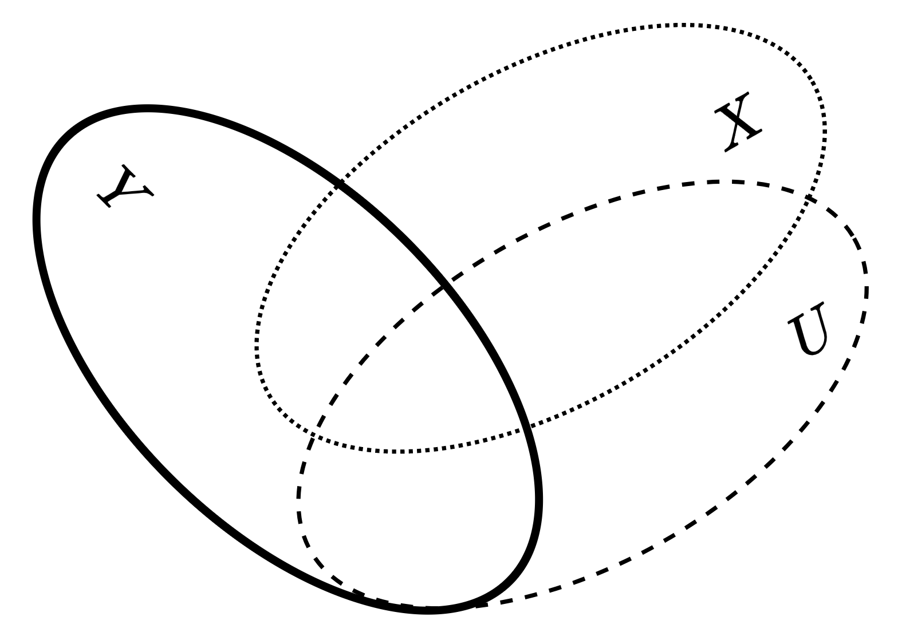
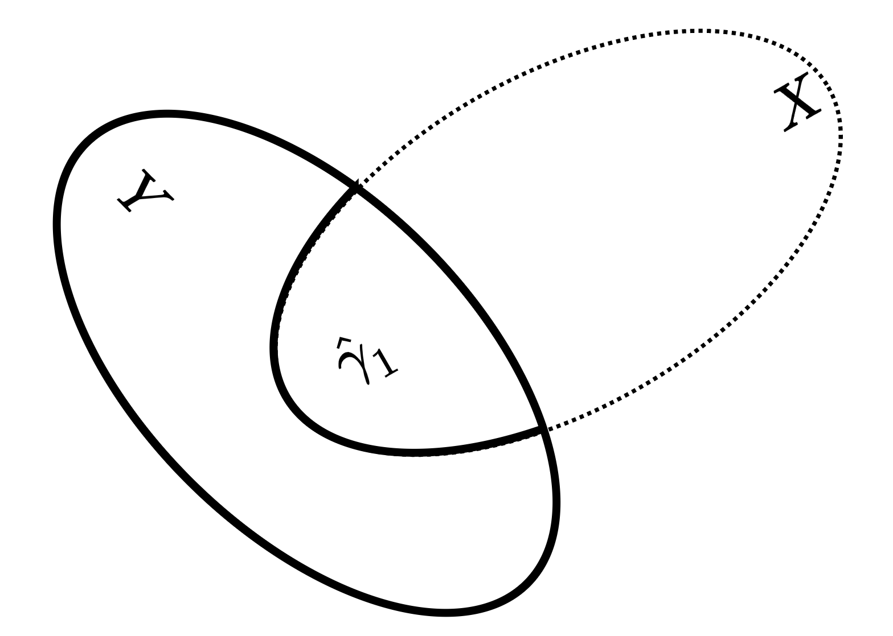
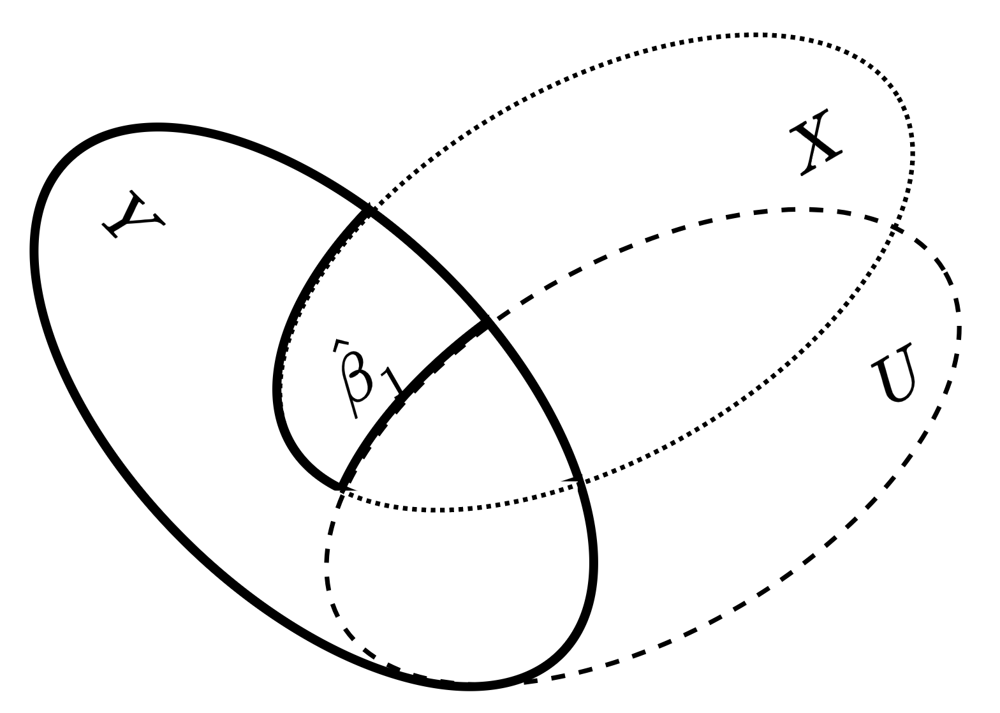
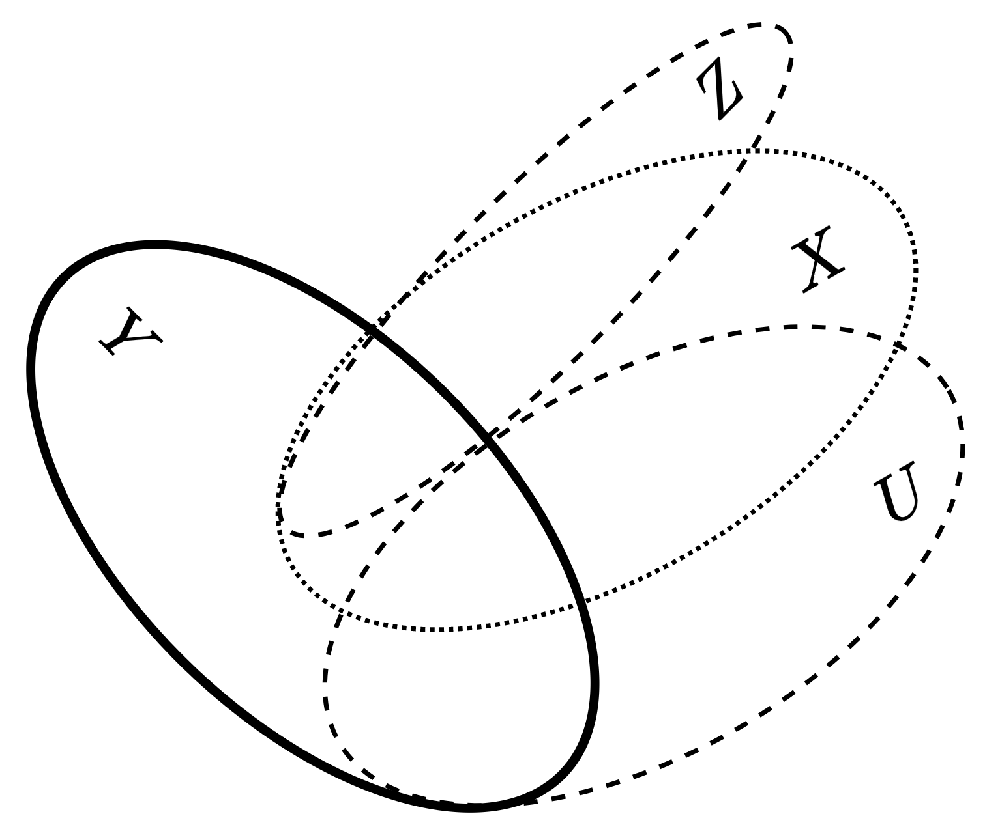
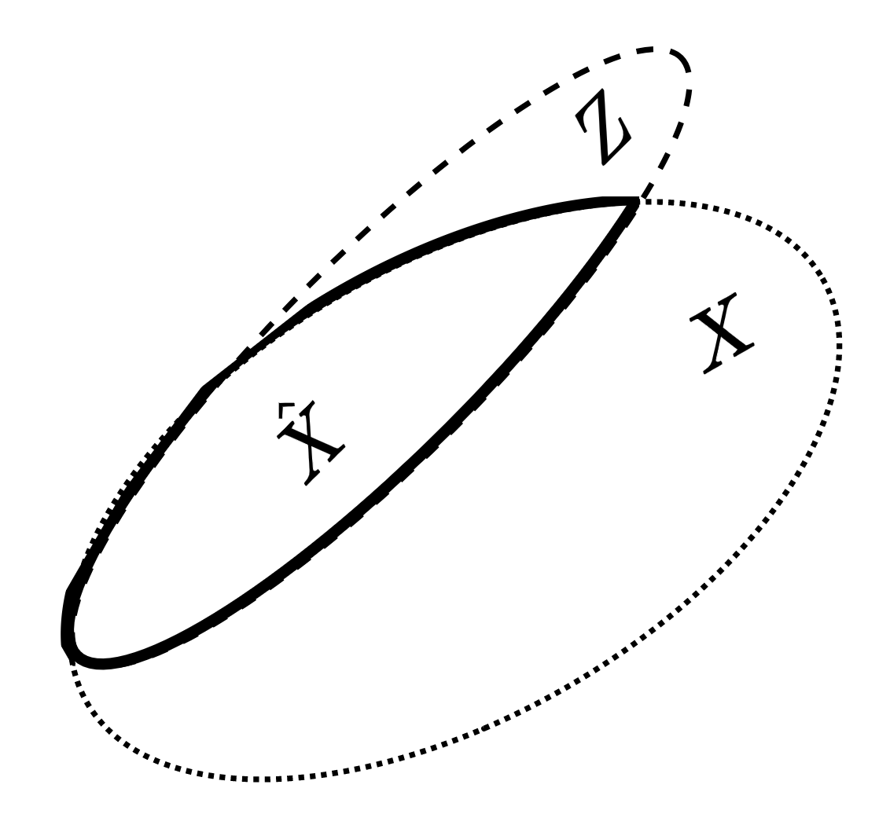
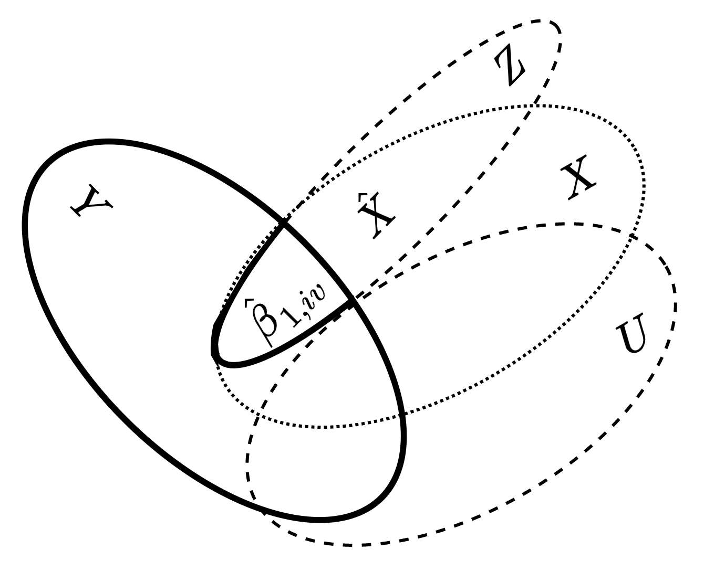
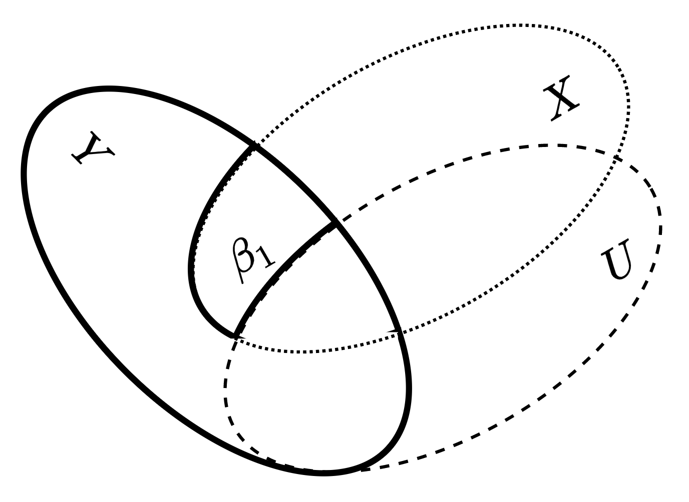
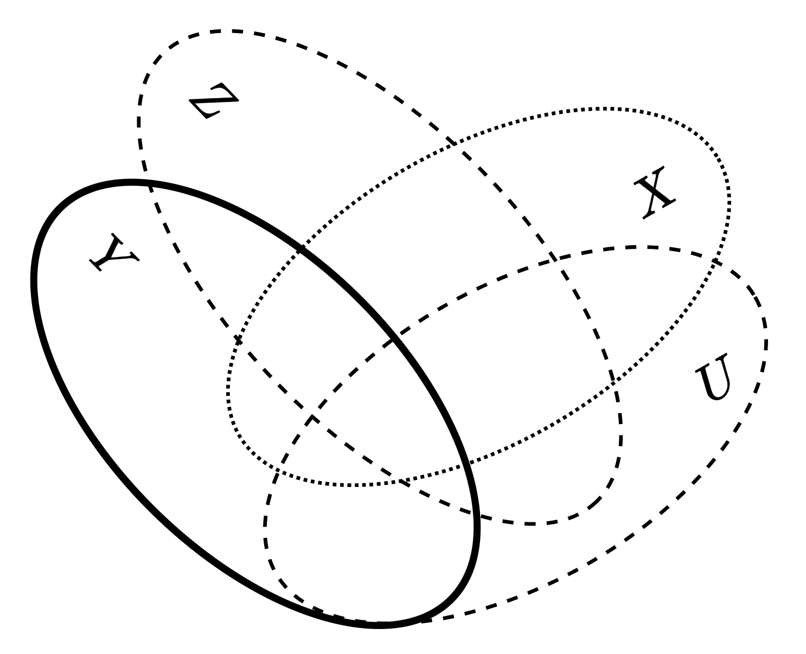
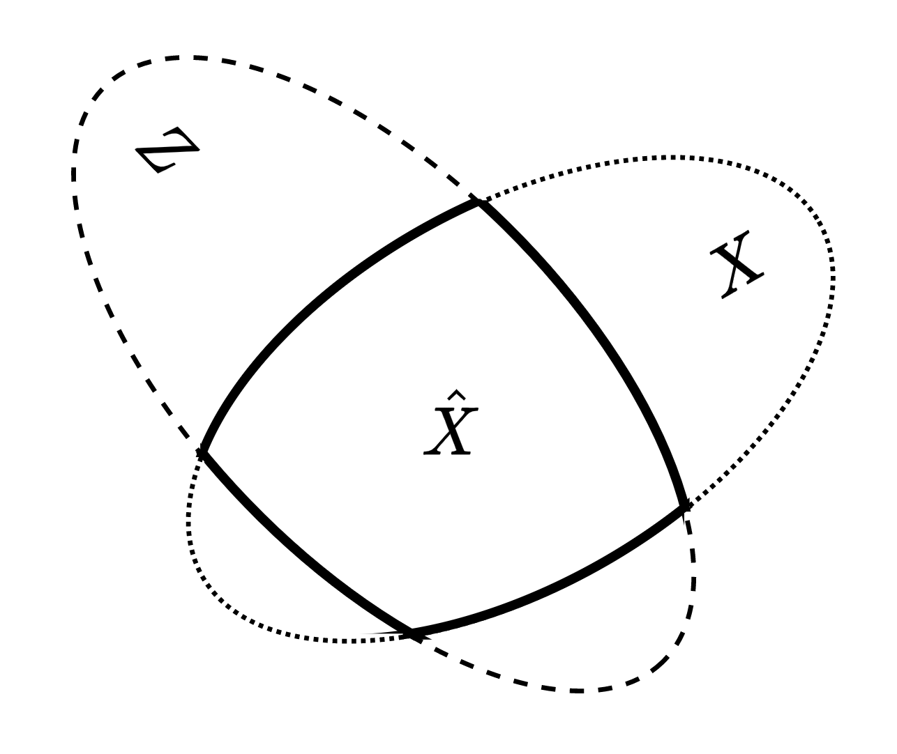
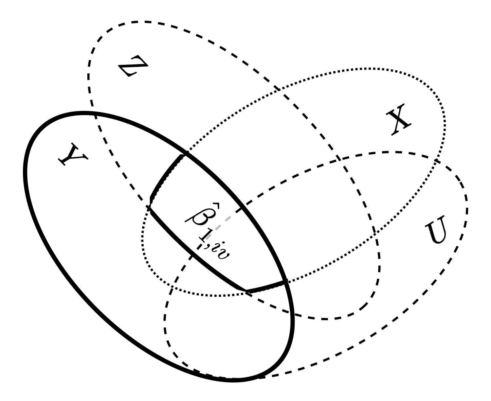

------------------------------------------------------------------------

# はじめに

-   ここまで、無視可能な割付が成立している場合に使用できる手法を扱ってきた
    -   i.e. 十分な共変量をモデル調整に取り入れをることで交絡を調整する手法
-   この仮定が成り立たない場合でも有効な統計的因果推論の手法はあるだろうか？
-   操作変数法では、一連の仮定(後述)を置くことで、可能になるとされている
-   本章では、一連の仮定・条件とそのメカニズムを扱う
-   操作変数法
    -   相互に関連する需要曲線と供給曲線の推定問題を解くために提案された
        -   Wright (1928, pp.286-319)
        -   古くから知られている
    -   計量経済学
        -   内生性と外生性の問題(13.6 節で扱う)を扱う手法
        -   標準的な教科書にはほぼ必ず掲載されているらしい
-   まずは、計量経済学における操作変数法の基本的な考え方を与える

------------------------------------------------------------------------

本章で使うデータを読み込んでおきます

```{r データ読み込み, warning=FALSE}
library(tibble)
library(knitr)
library(kableExtra)
library(DiagrammeR)

```

```{r}
rm(list=ls())

load_data <- function(){
  url.data.file <- "https://raw.githubusercontent.com/mtakahashi123/causality/main/data11.csv"
  D <- read.csv(url(url.data.file))
  return(D)  
}

D <- load_data()

tabular <- function(df, color=F, title="表"){
    df %>%
    rownames_to_column(var="ID") %>%
    kable(caption=title) %>%
    kable_styling(fixed_thead=T, bootstrap_options=c("striped", "hover", "condensed"))
}

# tabular(D[1:5, ])
```

------------------------------------------------------------------------

# 13.1 操作変数のイメージ図

-   Y を結果変数、X を観測される共変量、U を観測されない共変量とする
-   変数間の関係は、以下図(13.1)の通り

**図13.1 (テキストでは左)**

```{r 図13.1, warning=FALSE}
grViz("
	digraph causal_graph_13_1 {
	
	  # Nodes
	  node [shape=plaintext, fontname='Helvetica italic']
	  # X2 [label=<X<sub>2</sub>>]
	  U [label='U']
	  X [label='X']
	  Y [label='Y']
	  
	  # Edges
	  edge [color=black, arrowhead=vee]
	  rankdir = TB
	  U -> X
	  U -> Y
	  X -> Y

	  {rank=same; X; Y}

	  # Graph
	  graph [overlap=true, fontsize=10]
	}")
```

{width="500"}

-   $X$ から $Y$ への効果を知りたいとしよう
    -   $U$ から$X, Y$ に矢印が出ているので、$U$ は交絡因子
    -   $Y = \beta_0 + \beta_1 X + \beta_2 U + \epsilon$
    -   $X, U$ : 相関がある
-   $U$ をモデルに入れずに単回帰モデル$\hat{Y} = \hat{\gamma}_0 + \hat{\gamma}_1 X$ を構築
    -   下記図13.2 の $X, Y$ の重なった部分が、$\hat{\gamma}_1$

{width="500"}

{width="500"}

-   もし、$U$ が観測されるなら、$U$ をモデルに取り入れる
    -   共分散分析や傾向スコアモデリングによって交絡を取り除くことができる
-   仮に、重回帰モデル $\hat{Y} = \hat{\beta}_0 + \hat{\beta}_1 X + \hat{\beta}_2 U$ を推定すると
    -   $\hat{\beta}_1$ は、実線で囲まれた箇所（図参照）
    -   交絡を除いた $X$ から $Y$ への純粋な因果効果
-   しかし、今考えている $U$ は、観測されない共変量であった
    -   つまり $U$ を直接、モデルに取り込んで交絡を取り除けない
-   除外変数による偏り(omitted variable bias)が不可避に発生しうる
-   3.8節でいうところの強い意味での無視可能性の仮定がみたされないため、適切な因果推論ができなさそう
    -   振り返り用
        -   無視可能な割付け：SUTVA & (3.16) & (3.17)
            -   (3.16) 無交絡性 $\{Y_i(1), Y_i(0) \perp T_i | X\}$
            -   (3.17) 条件付き正値性 $0 < P(T=1 | X) < 1$
        -   p39 より「強い意味での無視可能な割付け」は、
        -   「観測値による選択あるいは除外変数による偏りがないこととして知られている」
            -   ここでは、$A \rightarrow B \lor C$ という構文ではなく、
            -   文脈を踏まえて考察する限り、$A \rightarrow B$ か $A \rightarrow C$ が使われる、という意味であろう
            -   つまり、「強い意味での無視可能な割付けは、観測値による選択がない」、「強い意味での無視可能な割付けは、除外変数による偏りがない」と言われる、ということである
            -   本節では、後者を対象としていると考えられる
        -   i.e. 除外変数による偏りがあるなら、強い意味での無視可能な割付けができていない、ということ
-   下図の通り、観測される共変量として $Z$ が利用できるとしよう

**図13.3 (テキストでは左)**

```{r 図13.3, warning=FALSE}
fig.13.3 <- function(){
  grViz("
  	digraph causal_graph_13_3 {
  	
  	  # Nodes
  	  node [shape=plaintext, fontname='Helvetica italic']
  	  # X2 [label=<X<sub>2</sub>>]
  	  U [label='U']
  	  X [label='X']
  	  Y [label='Y']
  	  Z [label='Z']
  	  
  	  # Edges
  	  edge [color=black, arrowhead=vee]
  	  rankdir = TB
  	  U -> X
  	  U -> Y
  	  X -> Y
  	  Z -> X
  
  	  {rank=same; Z; X; Y}
  
  	  # Graph
  	  graph [overlap=true, fontsize=10]
  	}")
}

fig.13.3()
```

-   この $Z$ は、$U$ からも、$Y$ からも矢印が出ていない
-   $Z$ は、
    -   $X$ に対して直接的に影響を及ぼしている
    -   $Y$ に対しては、$X$ を通じて間接的に影響を与えているのみ
-   このような $Z$ を、
    -   $X$ に対する 操作変数 (IV: Instrumental Variable) という

バレンティン・ベン図は、以下の通り

{width="500"}

-   $Z$ は
    -   $X$ と重なりがある
    -   $Y$ とは、$X$ と共に重なりがある
        -   $Y$ とは、単独では($X$ の範囲を超えて)重ならない
    -   $U$ とは重なりがない
-   岩崎, 2006, p.61
    -   このような、操作変数 $Z$ を用いることで
    -   観測されない共変量 $U$ の影響を取り除き
    -   処置効果を適切に推定可能になる
-   本章では、このメカニズムを具体的に検討していく

------------------------------------------------------------------------

# 13.2 操作変数の定義 {#操作変数の定義}

## 定式化

-   $X_{1i}, X_{2i}$ には、相関があるとする
-   $\epsilon _i$ : 誤差項
    -   第７章、第８章の仮定を満たすものとする
        -   第7章
            -   **仮定１：誤差項の期待値ゼロ**
            -   仮定２：パラメータ（母数）における線形性
            -   **仮定３：誤差項の条件付き期待値ゼロ**
        -   第８章
            -   仮定４：完全な多重共線性がないこと　
            -   **仮定５：誤差項の分散均一性**
            -   **仮定６：誤差項の正規性**

$$
\begin{align}
& Y_i = \beta_0 + \beta_1 X_{1i} + \beta_2 X_{2i} + \epsilon _i \\
& \text{cov}[X_1, X_2] \ne 0 \\
\tag{13.1}
\end{align}
$$

-   次に、$X_{2i}$ が観測されないとする
    -   $X_{2i}$ をモデルに含めることができない
-   次式(13.2) の通り
    -   (注意) テキストでは、$\beta_2$ などの $Z$ の係数の記載がない
    -   (感想) 係数の記載もれではない様子。13.7 の R コードでは、`2 * u1` としているのと整合は取れないが・・
        -   ただ、式を追っていくと、$Z$ が操作変数であれば、$\text{cov}[Z, U] = 0$ であるため、どちらでもよいし、
        -   $\beta_2 U$ とモデル化したとしても、$U$ は観測できないため、$\beta_2 U$ を改めて、$U$ と置き直しても本質的には同じでしょう
-   ここで、$\beta_1$ を推定しようとしても
    -   7.3 節の **仮定３：誤差項の条件付き期待値ゼロ** が、満たされていないため
    -   $\beta_1$ を偏りなしで推定できない

$$
\begin{align}
& Y_i = \beta_0 + \beta_1 X_{1i} + U_{i} + \epsilon _i \\
& \text{cov}[X_1, U] \ne 0 \\
\tag{13.2}
\end{align}
$$

-   さて、ここで、$X_{1i}$ に対する操作変数 $Z_{i}$ があれば

    -   $\beta_{1}$ を適切に推定できることを示そう

-   定義

    -   $X_{1i}$ に対する操作変数 $Z_{i}$ とは、下記式(13.3), (13.4) を満たすことである

    **操作変数の外生性 (instrument exogeneity)**

    $$
    \text{cov}[Z, U] = 0
    \tag{13.3}
    $$

    **操作変数の関連性 (instrument relevance)**

    $$
    \text{cov}[Z, X_1] \ne 0
    \tag{13.4}
    $$

-   意味

    -   つまり、操作変数 $Z_{i}$ は、未観測の交絡変数 $U_i$ とは関連がなく、かつ
        -   観測されている共変量 $X_{1i}$ と関連がある
    -   一般に、操作変数 $Z_i$ は、共変量 $X_{1i}$ 以外の $Y_i$ に影響を与えるすべての共変量と関連がないこと

-   式 (13.3)

    -   DAG において、$U, Y$ から $Z$ に矢印がないこと
    -   ベン図 において、$Z$ と $U$ に重なりがなかったこと
    -   ただし、式 (13.3) は、未観測の変数$U_i$ に対するものであるため、検証する術はない点に注意
        -   つまり、理論や背景知識（ドメイン知識）を用いて、省察するしかない

-   式 (13.4)

    -   一方、$Z_i, X_{1i}$ は、両方とも観測される変数なので、検証可能
    -   $X_{1i} = \delta_0 + \delta_1 Z_i + V_i$ の、$\delta_1$ を検定すればよい
    -   $\delta_1$ は、回帰の傾き、共分散を説明変数の分散で割ったもので計算可能
    -   i.e.
        -   $\delta_1 = \text{cov}[Z, X_1] / \text{var}[Z]$
    -   検定結果として、$\delta_1 \ne 0$ であることが言えればよい
        -   $\text{var}[Z] \ne 0$ でなければならない
            -   $\text{var}[Z] = 0$ の場合は、$\delta_1$ が定義されないため
            -   (所感) 実計算上は、$|\text{var}[Z]|$ が十分 $0$ よりも大きいことを確認すれば良さそうである
                -   例えば、Python の numpy のように、定数 $eps$ を用意して、それよりも大きいと判定すればよい
        -   また、$\text{var}[Z]$ が近似的に無限大と同程度に大きくない限り
            -   $\text{cov}[Z, X_1] \ne 0 \Rightarrow \delta_1 \ne 0$

-   主張

    -   式 (13.3) と 式 (13.4) が満たされていれば、式 (13.2) の $\beta_1$ を識別することができる

-   なぜそうなるかを見ていく

-   まず

    -   下式 (13.5) の通り、操作変数 $Z_i$ と 結果変数 $Y_i$ の共分散を確認する

$$
\text{cov}[Z, Y] = \text{cov}[Z, \beta_0 + \beta_1 X_1 +U]
\tag{13.5}
$$

-   ここで、確率変数 $X, Y$ が独立でない場合の、共分散の性質を見る (線形性 / 双線形性)

$$
\text{cov}[X_1, Y_1 + Y_2] = \text{cov}[X_1, Y_1] + \text{cov}[X_1, Y_2]
$$ - 式 (13.5) は、以下のように変形可能

$$
\text{cov}[Z, Y] = \text{cov}[Z, \beta_0] + \text{cov}[Z, \beta_1 X_1] + \text{cov}[Z, U]
\tag{13.6}
$$

-   $\beta_0$ は、定数であるので、$\text{cov}[Z, \beta_0] = 0$
-   また、$\beta_1$ も、定数であるので、$\text{cov}[Z, \beta_1 X_1] = \beta_1 \text{cov}[Z, X_1]$
-   式 (13.6) は、以下のように変形可能

$$
\text{cov}[Z, Y] = \beta_1 \text{cov}[Z, X_1] + \text{cov}[Z, U]
\tag{13.7}
$$

-   式 (13.3) の仮定が満たされているなら (i.e. $\text{cov}[Z, U] = 0$)

$$
\text{cov}[Z, Y] = \beta_1 \text{cov}[Z, X_1]
\tag{13.8}
$$

-   式 (13.4) の仮定が満たされているなら (i.e. $\text{cov}[Z, X_1] \ne 0$)
    -   両辺を $\text{cov}[Z, X_1]$ で、割ることができるので

$$
\beta_1 = \frac{\text{cov}[Z, Y]}{\text{cov}[Z, X_1]}
\tag{13.9}
$$

## 操作変数推定量(定義)

-   この式 (13.9) のようにして、推定する $\beta_1$ を、**操作変数推定量**と呼ぶ
-   5.3節より、最小二乗法による $\beta_1$ の推定値は
    -   $\beta_{1,ols} = \text{cov}[X_1, Y] / \text{var}[X_1]$ であった
    -   この式は、上式 (13.9) の、$Z$ に、$X_1$ を代入したものと一致することがわかる
    -   つまり、5.3節の最小二乗法による、$\beta_1$ の推定値を拡張・一般化したものが、操作変数推定量の式(13.9)である　
-   改めて触れるが
    -   操作変数 $Z_i$ が、$X_{1i}$ と関連していない場合、$\text{cov}[Z, X_1] = 0$ になり、$\beta_1$ が推定できない
        -   分母が $0$ になるケースのため
-   操作変数 $Z_i$ が $U_i$ と相関している場合、$\text{cov}[Z, U] \ne 0$ になる
    -   式 (13.7) からの式変形は、以下のような式 (13.10) のようになる
    -   i.e. (13.9) の操作変数推定量とは異なる推定値になる

$$
\beta_1 = \frac{\text{cov}[Z, Y]}{\text{cov}[Z, X_1]} - \frac{\text{cov}[Z, U]}{\text{cov}[Z, X_1]}
\tag{13.10}
$$

-   除外制約 (exclusion restriction)
    -   操作変数 $Z_i$ が誤差項 $U_i$ と無相関であること
    -   既出の図13.3 において、
        -   $Z$ から、$X$ に矢印はあるが
        -   $Z$ からは、$Y$ への直接的な矢印はなく、$X$ を通して間接的に影響を与えるのみであることに対応する
        -   $X$ の値が決まれば、$Z$ の有無に関係なく、$Y$ への影響は同じであるということ

```{r}
fig.13.3()
```

-   例 : 禁煙と肺機能
    -   $Z$ : 医師から禁煙を推奨されること
    -   $X$ : 禁煙すること
    -   $Y$ : 肺機能
    -   除外制約
        -   実際に、禁煙$X$したなら、
        -   医師から禁煙を推奨$Z$ されるかどうかに関係なく
        -   肺機能$Y$への影響は同じ

## まとめ

-   操作変数の３つの仮定
    -   仮定1：操作変数の外生性 ／ $\text{cov}[Z, U] = 0$
    -   仮定2：操作変数の関連性 ／ $\text{cov}[Z, X_1] \ne 0$
    -   仮定3：除外制約 ／ $X$ の値が決まれば、$Z$ に関係なく、$Y$ への影響は同じ

------------------------------------------------------------------------

# 13.3 Rによる操作変数推定量

**データの生成と共分散の値**

-   操作変数の仮定1, 2, 3 を満たすようにデータを生成する

```{r}
set.seed(1)
n1 <- 1000
x2 <- rnorm(n1)
z1 <- runif(n1)                       # 操作変数は、他(一様分布以外)の分布でも良い
e1 <- rnorm(n1)

x1 <- 1 + 2 * z1 + 2 * x2 + e1        # 仮定2：操作変数の関連性

e2 <- rnorm(n1)
y1 <- 3 + 1.5 * x1 + 1.5 * x2 + e2    # 仮定3：除外制約
u1 <- x2 + e2                         # 仮定1：操作変数の外生性

cov(x1, u1)
cov(z1, u1)     # 数値上は、ゼロに近い値であればよい
cov(z1, x1)
cov(z1, y1)
```

```{r}
sr1 <- lm(y1 ~ x1)                  # 単回帰
mr1 <- lm(y1 ~ x1 + x2)             # 重回帰
iv1 <- cov(z1, y1) / cov(z1, x1)    # 式 (13.9) による β1 の推定値

summary(sr1)
summary(mr1)

sr1$coefficients["x1"]
mr1$coefficients["x1"]
iv1
```

-   単回帰モデル(sr1) のx1 の回帰係数は、$2.048$
    -   真値$1.5$ に対して、過大推定している
-   重回帰モデル(mr1) のx1 の回帰係数は、$1.493$
    -   これは、正しいモデルであるので、真値$1.5$ に対して正しく推定できている
    -   しかし、実際には推定不可能である点に留意する
-   最後に、操作変数法による推定値(iv1)は、$1.550$
    -   真値$1.5$ をほぼ正しく推定できている
    -   つまり、操作変数$z1$ を用いることで、未観測の変数x2 の交絡を取り除くことができるとわかる

**操作変数の関連性の確認**

```{r}
modelDiag1 <- lm(x1 ~ z1)

summary(modelDiag1)

modelDiag1$coefficients["z1"]
```

-   上のRコードは、$X_{1i} = \delta_0 + \delta_1 Z_i + V_i$ の $\delta_1$ を検定するための診断モデル
    -   変数z1 の回帰係数は、$2.324$
    -   5% 有意水準で、有意 (`***` なので、p値は、0.001 未満)
    -   つまり、操作変数の関連性に問題ないと言える
    -   cf. p186 上部
-   (感想) 今回は、生成手順を神様の立場で見ているため、この検定は自作自演
    -   実際に使う際には、この手順は必要だと考えられる
-   Wooldridge, 2020,l p.498
    -   $\delta_1$ の係数の符号にも注意が必要
    -   今回の変数は、単なる乱数なので、背景知識（ドメイン知識）は何もない
    -   実用上は、背景知識を利用して、$Z_{i}$ と $X_{1i}$ との関連が正・負どちらの関係であるべきか
        -   診断モデルによる回帰係数の符号がその背景知識による正・負の関係と一致しているか確認すべきである
    -   合致していない場合、操作変数の関連性に問題があると考えよう

------------------------------------------------------------------------

# 13.4 二段階最小二乗法１：操作変数が１個の場合

-   操作変数推定量は、二段階最小二乗法(2SLS: Two Stage Least Squares)による回帰モデルで計算可能
-   $X_{1i}$に対する操作変数$Z_i$が、仮定を満たす必要がある
    -   仮定1：操作変数の外生性 ／ $\text{cov}[Z, U] = 0$
    -   仮定2：操作変数の関連性 ／ $\text{cov}[Z, X_1] \ne 0$
-   まず、関連性を検証する
    -   i.e. $X_{1i} = \delta_0 + \delta_1 Z_i + V_i$ の $\delta_1$ を検定する
-   二段階最小二乗法 (Wooldridge, 2020, p.510)
    -   1段階目: $\hat{X_{1i}} = \hat{\delta}_0 + \hat{\delta}_1 Z_{i}$ を推定
        -   この推定は、通常の最小二乗法(OLS) で推定
    -   2段階目: $\hat{Y_{i}} = \hat{\beta}_0 + \hat{\beta}_{1,iv} \hat{X}_{1i}$ を推定
        -   $X_{1i}$ を操作変数として、$\hat{\beta}_{1,iv}$ を推定

$$
\hat{X_{1i}} = \hat{\delta}_0 + \hat{\delta}_1 Z_{i} \\
\hat{Y_{i}} = \hat{\beta}_0 + \hat{\beta}_{1,iv} \hat{X}_{1i} \\
\tag{13.11}
$$

-   ここで
    -   操作変数$Z$ があれば、未観測の交絡因子$U$ を無視しても、なぜ適切な因果推論ができるのか？
    -   視覚的に確認していこう

**バレンティン・ベン図**

{width="500"}

-   下図は、二段階最小二乗法の第一段階
    -   $\hat{X}$ は、$X$ の変動の中で$Z$ によって説明できる部分

{width="500"}

-   二段階目が下図13.5 (テキストでは左)
    -   $X$ の予測値$\hat{X}$ と結果変数$Y$ との関連$\hat{Y} = \beta_0 + \beta_{1,iv} \hat{X}$
    -   $\beta_{1,iv}$ が、操作変数推定量

{width="500"}

-   下図13.5 (テキストでは右) の、$\beta_{1}$ が真の$\beta_1$

{width="500"}

-   つまり、操作変数をうまく設定できれば
    -   観測されない $U$ を無視しても$\beta_1$ をほぼ適切に推定できる様子が視覚的にわかる
-   式 (13.9) の分子と分母を $\text{var}[Z] (\ne 0)$ で割ると、式 (13.12) が得られる

$$
\hat{\beta}_{1,iv} = \frac{\text{cov}[Z, Y] / \text{var}[Z]}{\text{cov}[Z, X_1] / \text{var}[Z]} = \frac{\hat{\beta}_{zy}}{\hat{\delta}_1}
\tag{13.12}
$$

-   操作変数推定量$\hat{\beta}_{1,iv}$ は、２つの回帰係数の比になっているとわかる
    -   $\text{cov}[Z, X_1] / \text{var}[Z]$ は、式 (13.11) における一段目の$\hat{\delta}_1$
    -   $\text{cov}[Z, Y] / \text{var}[Z]$ は、$Z$ から $Y$ への回帰における傾き $\hat{\beta}_{zy}$

------------------------------------------------------------------------

# 13.5 二段階最小二乗法２：操作変数が複数個の場合

-   操作変数が1個の場合
    -   式 (13.9): 共分散の比、(13.11): 二段階最小二乗法、のいずれを使って操作変数推定量を計算してもよい
-   操作変数が複数個の場合
    -   どれか1つの操作変数を選定して、推定するよりも
    -   複数の操作変数を組み合わせて推定することで、推定量の分散を小さくするようにすべきであろう
    -   式(13.11) が役に立つ（らしい）
-   手法
    -   3つの変数 $Z_1, Z_2, U$ があり、$Z_1, Z_2$ は両方とも、$U$ と無相関としよう
        -   この時、$Z_1$ と $Z_2$ の線型結合も、無相関になることに留意する
        -   i.e. $\text{cov}[a Z_1 + b Z_2, U] = 0$ である (for $\forall a, \forall b \in \mathbb{R}$)
    -   $Z_1$ と $Z_2$ の線型結合を、操作変数として用いればよい (Wooldridge, 2020, p.509)
-   具体例
    -   $Z_{1i}, Z_{2i}$ : $X_{1i}$ に対する操作変数, 共に仮定1, 仮定2 を満たすものとする
        -   仮定1：操作変数の外生性 ／ $\text{cov}[Z, U] = 0$
        -   仮定2：操作変数の関連性 ／ $\text{cov}[Z, X_1] \ne 0$
    -   今回は、操作変数が2個ある
        -   $Z_{1i}, Z_{2i}$ の線型結合を操作変数として用いる
        -   i.e. $\hat{X}_{1i} = \hat{\delta}_0 + \hat{\delta}_1 Z_{1i} + \hat{\delta}_2 Z_{2i}$
        -   $\hat{\delta}_1 Z_{1i} + \hat{\delta}_2 Z_{2i}$ が操作変数
        -   このモデルの推定は、通常の最小二乗法(OLS) によって実行する
    -   二段階最小二乗法
        -   第一段階：$\hat{X}_{1i}$ を推定
        -   第二段階：$\hat{X}_{1i}$ を操作変数として、$\hat{\beta}_1$ を推定

$$
\hat{X}_{1i} = \hat{\delta}_0 + \hat{\delta}_1 Z_{1i} + \hat{\delta}_2 Z_{2i} \\
\hat{Y}_{i} = \hat{\beta}_0 + \hat{\beta}_1 \hat{X}_{1i} \\
\tag{13.13}
$$

------------------------------------------------------------------------

# 13.6 内生変数と外生変数

$$
Y_1 = \beta_0 + \beta_1 Y_2 + \epsilon_1 \\
Y_2 = \gamma_0 + \gamma_1 Y_1 + \gamma_2 X_1 + \epsilon_2 \\
\tag{13.14}
$$

-   上式 (13.14) の連立方程式(simultaneous equations)があるとしよう
    -   $Y_1, Y_2$ : 内生変数 (endogenous variable)
        -   連立方程式のシステム内で決定される変数であることから
        -   機械学習の文脈では、特徴量のこと (未来の情報は手に入らない)
        -   結果変数と中間変数は、内生変数
        -   観察研究では、処置変数は内生変数 (宮川, 2004, p.38)
    -   $X_1$ : 外生変数 (exogenous variable)
        -   連立方程式のシステム外で決定される変数であることから
        -   機械学習の文脈では、日付情報や天候情報の推定値など (未来の情報も手に入る)
        -   モデルの依存関係によらず定まる変数 (山本, 1995, p.248; 朝の・中村, 2009, p.180; 清水, 2017, p.24)
        -   操作変数は、外生変数の一種
        -   操作変数でない外生変数を、「外生的な共変量 (exogenous covariate)」という
        -   共変量は、外生変数
        -   処置の割付けが無作為化されているなら、処置変数は外生変数
    -   計量統計学の一つの定義例 (西山・新谷・川口・奥井, 2019, pp.147-149)
        -   モデルの誤差項と相関のある変数を内生変数
        -   誤差項と相関がない変数を外生変数

------------------------------------------------------------------------

# 13.7 Rによる二段階最小二乗法

```{r}
set.seed(1)
n1 <- 1000

u1 <- rnorm(n1)
z1 <- runif(n1)
z2 <- runif(n1)
e1 <- rnorm(n1)

x1 <- 1 + 2 * z1 + 2 * z2 + 2 * u1 + e1

e2 <- rnorm(n1)
y1 <- 3 + 1.5 * x1 + 1.5 * u1 + e2

```

-   推定対象は、y1 の 右辺の x1 の偏回帰係数$1.5$ であることを留意しておこう

**二段階最小二乗法**

```{r}
first <- lm(x1 ~ z1 + z2)
x1.hat <- predict(first)
second <- lm(y1 ~ x1.hat)
```

**一段階目の結果**

```{r}
summary(first)

first$coefficients["z1"]
first$coefficients["z2"]
```

-   操作変数z1, z2 の回帰係数は、共に、有意水準5% で有意 (共に、`***` のため)
    -   操作変数の関連性は、どちらもOK
    -   実用上は、F検定の結果(summary の最後の行に出力される)も見ておこう
        -   i.e. すべての偏回帰係数が0 であるかどうかの検定
        -   今回は、乱数で関連性があるように作っているので、正しいこと(有意であること)はわかっている
        -   また、偏回帰係数の符号にも注意しよう

**二段階目の結果**

```{r}
summary(second)

second$coefficients["x1.hat"]
```

-   x1 の偏回帰係数が、$1.572$ と推定されている
    -   真値は、$1.5$ であったので、ほぼ正しく推定できている、と言えよう
-   標準誤差 に注意 ($0.1815$ と表示されているが・・そのまま使わないこと)
    -   というのも、この方法では、誤差項の一部しか考慮に入れていない (Wooldridge, 2020, p.510)
-   適切に標準誤差を算出するには、以下のようにする
    -   実用上は、さらに次の Rパッケージの関数を使うと簡単で良さそう

**標準誤差の算出**

(Gelman and Hill, 2007, pp.222-223)

```{r}
y.hat2 <- coef(second)[1] + coef(second)[2] * x1      # 2.7846 + 1.5723 * x1
resid2 <- y1 - y.hat2
resid2.sd <- sd(resid2)

summary(second)$coefficient[2, 2]     # x1.hat に対する偏回帰係数の標準誤差
se1 <- summary(second)$coefficient[2, 2]

summary(second)$sigma                 # Residual standard error の値
resid.se <- summary(second)$sigma

x1.std.err <- se1 * resid2.sd / resid.se
x1.std.err
```

-   このようにして計算した、$0.0626$ を標準誤差として、信頼区間を構築すればOK

## Rパッケージ AER, ivreg 関数

-   ivreg の構文
    -   ivreg(y \~ ex + en \| ex + in)
    -   ex: 外生的な共変量
    -   en: 内生的な共変量
    -   in: 操作変数

```{r}
library(AER)

model.IV <- ivreg(y1 ~ x1 | z1 + z2)

summary(model.IV)
confint(model.IV)

x1.std.err                                # さっき、計算した x1 の Std. Error
summary(model.IV)$coefficient[2, 2]       # x1 の Std. Error (大体一致する)
```

-   注意
    -   二段階最小二乗法でも、誤差項の不均一分散は、問題である
        -   これは、通常の最小二乗法による回帰分析と同じ
        -   8.2.2 項で扱った 「ブルーシュ・ペイガン検定」で診断できる点も同じ
        -   8.2.3 項を応用して、加重二段階二乗法でも対処可能
        -   8.2.4 項で扱った不均一分散に頑健な標準誤差を用いることもできる
-   不均一分散への対応
    -   R では、ivreg の 引数として、`vcov=sandwich` と指定する
    -   今回のデータでは、不均一分散は特に問題にならない設定のため、出力結果はほとんど同じになる

**二段階最小二乗法における頑健な標準誤差**

```{r}
summary(model.IV, vcov=sandwich)

summary(model.IV)$coefficient[2, 2]                   # さっきの x1 の Std. Error
summary(model.IV, vcov=sandwich)$coefficient[2, 2]    # 今回の x1 の Std. Error
```

------------------------------------------------------------------------

# 13.8 二値変数の場合の二段階最小二乗法

-   処置の割付け変数$T_i$ を用いるケース / 二値変数のケースとして
    -   $T_i = 1$ : 処置群に割付け
    -   $T_i = 0$ : 統制群に割付け
-   推定対象は、下式 (13.15) の $\beta_1$
    -   $U_i$ が、未観測の交絡として悪さをしている

$$
Y_i = \beta_0 + \beta_1 T_i + U_i \\
\tag{13.15}
$$

-   ここで、
    -   $T_i$ に対する操作変数 $Z_i$ があるとする (複数あってもよい)
    -   $Z_i$ : 操作変数の定義を満たすものとする
        -   c.f [13.2 操作変数の定義](#操作変数の定義)
    -   下式 (13.16) のように、二段階最小二乗法によって推定する

$$
\hat{T_i} = \hat{\delta}_0 + \hat{\delta}_1 Z_i \\
\hat{Y_i} = \hat{\beta}_0 + \hat{\beta}_1 \hat{T_i} \\
\tag{13.16}
$$

-   この時、一段階目は、普通の重回帰モデルで良いだろうか？
    -   結果変数 $T_i$ が、二値なので、10.4.3 項で見た通り
        -   ロジスティック回帰やプロビット回帰モデルがより適しているのでは？という疑問が湧く
-   結論
    -   ロジスティック回帰やプロビット回帰モデルは、ふさわしくない
    -   一段階目には、最小二乗法を使うべき
-   根拠 (Angrist and Pischke, 2009, pp.190-191)
    -   一段階目に、最小二乗法を使った時だけ、一段階目の残差が予測値と共変量に無相関
        -   と知られている
    -   (所感) 本当に、「だけ」という唯一性が示されているか気になるところだが、
        -   少なくとも最小二乗法は理論的に保証されているということで安心である

------------------------------------------------------------------------

# 13.9 よくない操作変数

-   操作変数 $Z$ は、$Y$ と直接に関連する部分をもち、未観測の交絡変数 $U$ とも関連があるケースを考えよう
    -   つまり、操作変数 $Z$ は、実際には、操作変数ではないケースを考えていく
-   このような操作変数でない $Z$ をあたかも、操作変数として扱った場合、どのようなことが起こるか？！

{width="500"}

-   図13.6 (テキストでは左) にある通り
    -   $Y = \beta_0 + \beta_1 X + \beta_2 U + \epsilon_1$
    -   $X = \delta_0 + \delta_1 Z + \delta_2 U + \epsilon_2$

{width="500"}

-   図13.6 (テキストでは右) にある通り
    -   $\hat{X} = \hat{\delta}_0 + \hat{\delta}_1 Z$

{width="500"}

-   図13.7 (テキストでは左) にある通り
    -   $\hat{Y} = \hat{\beta}_0 + \hat{\beta}_{1,iv} X$
-   下図13.7 (テキストでは右) にある $\beta_1$ とは、異なる値を推定していることが視覚的にわかる
    -   つまり、未観測の交絡変数 $U$ からの影響を除去できていない、ということである

{width="500"}

------------------------------------------------------------------------

# 13.10 操作変数の妥当性の検証

-   R関数 ivreg では、引数 `diagnostics=TRUE` を指定することで
    -   3種類の診断結果を表示できる
        -   一段階目のモデルにおけるF検定の結果
        -   Wu-Hausman の内生性の検定の結果
        -   Sargan の過剰識別制約の検定の結果

```{r}
summary(model.IV, diagnostics=TRUE)
```

-   `Weak instruments`: 一段階目のモデルにおけるF検定の結果
    -   有意であれば、操作変数の関連性が満たされていると期待できる
-   `Wu-Hausman`: Wu-Hausman の内生性の検定の結果
    -   有意であれば、操作変数の外生性が満たされているとされる
-   `Sargan`: Sargan の過剰識別制約の検定の結果
    -   操作変数が必要な数以上にモデルに含まれている場合に使える検定である
    -   (所感) なぜか、有意であれば、という説明がない！笑
-   これらの結果について
    -   これらの結果がよければ安心して操作変数法を使えるといいたいところだが、しかし！
    -   これらの結果は、ミスリーディングな結果を返す傾向があると指摘されている
        -   (Muller et al., 2015, p.288; Wooldridge, 2020, p.517)
-   本書では、これらの検定について、詳しくは取り上げない (！？)
    -   詳細は、Wooldridge (2020, pp.515-518) を参照されたい
    -   西山・新谷・川口・奥井 (2019, pp.296-303)
        -   Sargan の過剰識別制約の検定を含むいくつかの検定を詳しく取り上げている（らしい）
-   Wooldridge, 2020, p.498
    -   操作変数の外生性(仮定1)が満たされる時、操作変数の関連性(仮定2)が満たされ難くなる
    -   逆に、操作変数の関連性(仮定2)が満たされる時、操作変数の外生性(仮定1)が満たされ難くなる
-   観察研究
    -   適切な操作変数を見つけることは本質的に難しい
    -   13.9 節でみた通り、操作変数が不適切だと、交絡を取り除くことはできない
        -   (感想) 正しく取り除くことができない、ということであろう
    -   操作変数法は、観察研究における除外変数バイアスを回避できる方法として期待されることがある
        -   しかし、そのような使用方法は、一般的には推奨されない (Angrist, Imbens, and Rubin, 1996, p.446)
        -   (感想) 実用上は、使わないとするより、問題を理解した上で使い、問題を軽減する対策を立てる方が有益そう
-   星野 (2016, p.78)
    -   「結局は、操作変数が解析者による何らかの操作や介入、突発的な災害や事故の前後といった変数以外では、操作変数法の解析結果はあまり信頼されません」と、厳しく指摘
-   操作変数法
    -   統計的因果推論では、役に立たないわけではない
    -   第１４章
        -   実験研究における非遵守(noncompliance) への対処法として活用
    -   第１８章
        -   ファジーな回帰不連続デザインというモデリングは、本質的に操作変数法
    -   これらの方法として活用できるので、本章で扱った操作変数法の基本事項は、統計的因果推論の立場で重要

------------------------------------------------------------------------

# 本章のまとめ

-   これまで、無視可能な割付けが前提の議論をしてきた
    -   観察研究などで、無視可能な割付けができない場合にはどうすべきか？
    -   そうだ！操作変数法へ行こう！
-   操作変数を導入するに当たっての変数間の関係を図で理解
-   操作変数の定義（3つの条件・仮定）
-   操作変数推定量 ($\hat{\beta}_{1, iv}$)
-   二段階最小二乗法
    -   操作変数が1個
    -   操作変数が複数個
    -   内生変数と外生変数の定義と例
        -   Rパッケージ の ivreg の一般形を理解するために、閑話休題的に補足したのであろう
    -   R で、二段階最小二乗法
    -   二値の場合どうする？
        -   ロジスティック回帰やプロビット回帰は使わないで
-   だめな操作変数
-   操作変数の妥当性の検証
    -   R での検証の仕方 (`diagnostic=TRUE`)
        -   3種類の検定 (詳しくは、参考文献を見てね)
-   観察研究では、適切な操作変数を見つけるのムズイよ！
    -   でも、１４章、１８章での基礎になってるので、本章は大事だよ♪

**End.**
